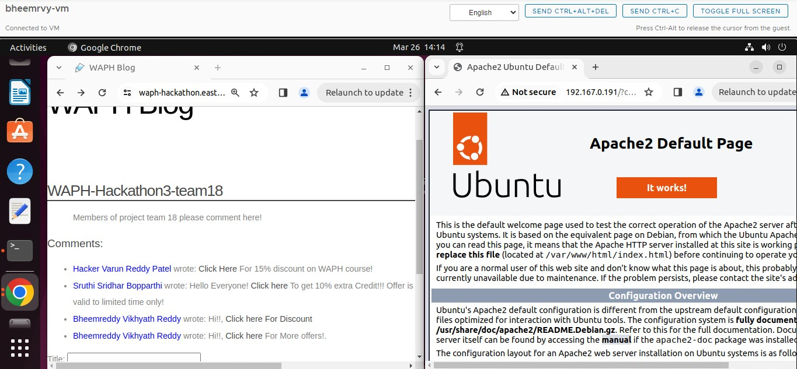

# WAPH-Web Application Programming and Hacking

## Instructor: Dr. Phu Phung

## Student

### Name: Bheemreddy Vikhyath Reddy
### Email: bheemrvy@mail.uc.edu

## Repository Information
### Repository's URL: [https://github.com/Vikhyath-Reddy/waph-bheemrvy](https://github.com/Vikhyath-Reddy/waph-bheemrvy)
### This is a private repository which is used to store all the codes related to course Topics in Computer Systems. The structure of this repository is as mentioned below.

# Hackathon 3 

## Lab's overview

This Hackathon teaches us the to execute attach on session by site scripting(XSS) on the given blog web page. As an attacker and as an victim I played two roles in this hackthon3 to widely understand the hijacking attack and indeed evaluating what kind of security measures eventually to perform in these situations.

Link to Hackthon3 code : [https://github.com/Vikhyath-Reddy/waph-bheemrvy/tree/main/Hackthons/Hackthon3]([https://github.com/Vikhyath-Reddy/waph-bheemrvy/tree/main/Hackthons/Hackthon3])

## Task 1: Attacks

### Task1 Overview 

With the intention to steal the cookie information, I inserted a malicious XSS code with a clickable link wanting to attract the victim to click it. When the victim signIN to the web blog application with genuiene logins in this case I have done the login creating a session. On seeing the comments on the blog in the application clicks on it thinking to view it which has the implanted code to steal the cookie. Then the attacker uses the session cookie of the victim which is stolen by means of server logs or any other ways. Using the session cookie information the attacker takes the control.

 

## Bonus

1. Identify Input Fields: Locate areas where user input is processed, like search bars or login forms, and even comments. Even look for the fields are content in application like unauthorized data access, error messages etc.
2. Test for SQL Injection: Inject SQL code into input fields to test for vulnerabilities, such as entering ' OR 1=1 in a login form.
3. Retrieve Data: Attempt to extract sensitive information from the database using SQL injection methods.
4. Document Findings: Record evidence such as error messages or SQL injection attempts.
5. Provide Solutions: Suggest implementing input validation and ORM frameworks to mitigate SQL injection risks.
6. Boost Security: Thoroughly assess and address vulnerabilities to enhance the application's security and prevent future exploits.

https://youtu.be/h0y-EU8LgPA

## Task 2 : Understanding and prevention

### Vulnerabilities exploited in Part I for successful attack

1. XSS Risk: Malicious code inserted in comments lets attackers steal session cookies, exploiting lax content sanitization. This grants them control over users' sessions. User generated content santization and disabling the javascript execution if having the user content can be done to avoid this particular situation.
2. Session Hijack: From step 5 Attackers use stolen session IDs to seize control, gaining unauthorized access, including admin privileges. Poor session management enables impersonation and unauthorized actions, posing severe security threats.

### b. Protection Mechanisums

1. Not allowing the user content into the blogs or santizing them to avoid the hijacking and even not allowing to run the javascripts. And check for tricks.

2. Make sure all the communication between users and your website is locked down tight with HTTPS. Also, keep session cookies hidden from prying eyes by setting them as HttpOnly.

3. Keep changing session IDs and kicking users out after a while to make it harder for anyone trying to hijack a session.

4. Put up a digital fence with Content Security Policy (CSP) to block any shady scripts from running on your site.

5. Keep sensitive session data safe on the server, and regularly check to make sure session tokens are legit to prevent any funny business.

6. Get some digital watchdogs to sniff out any security issues early on in development using fancy tools like code analyzers and vulnerability scanners.
