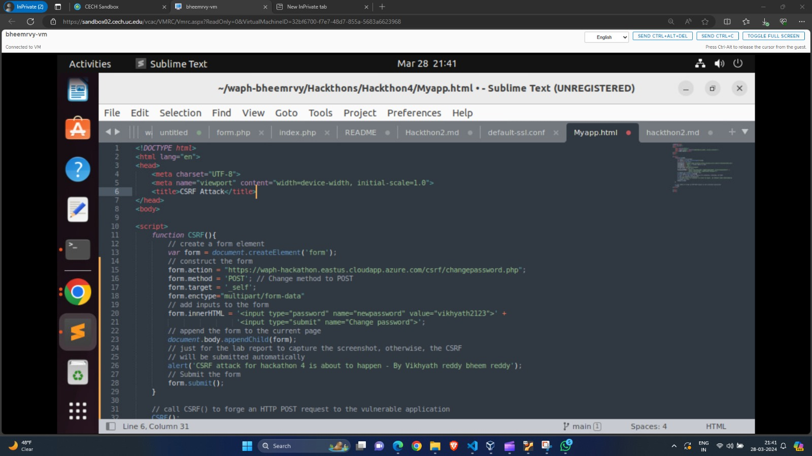
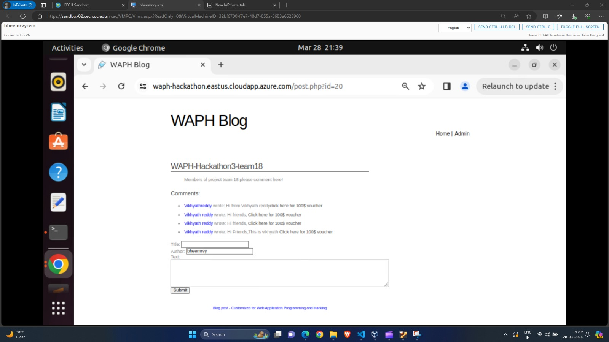
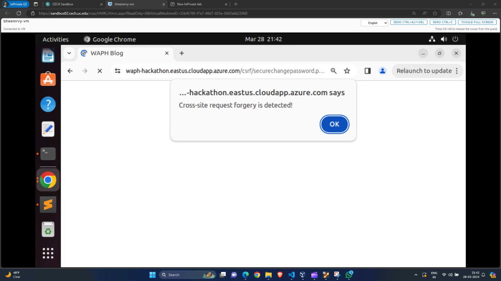
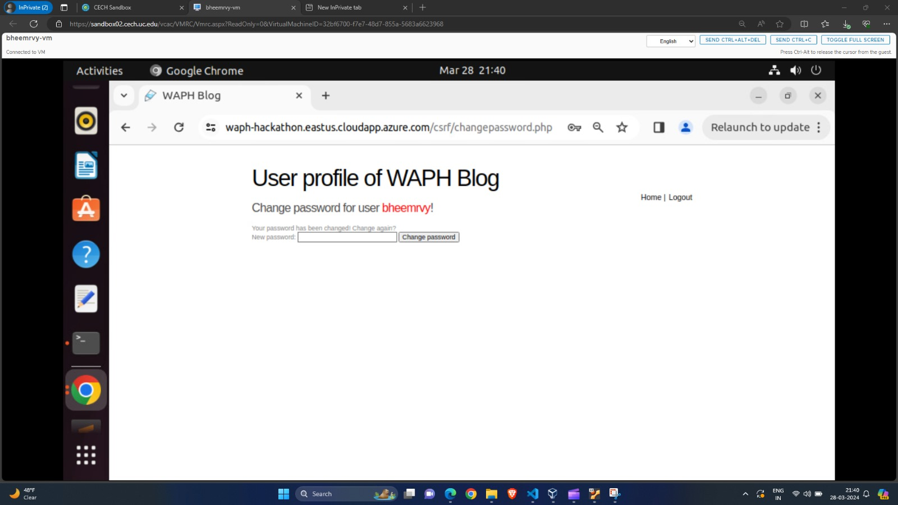
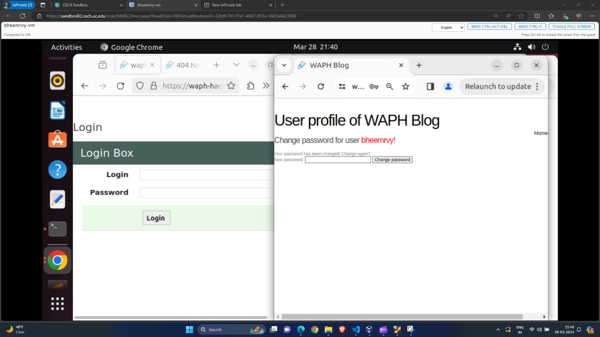
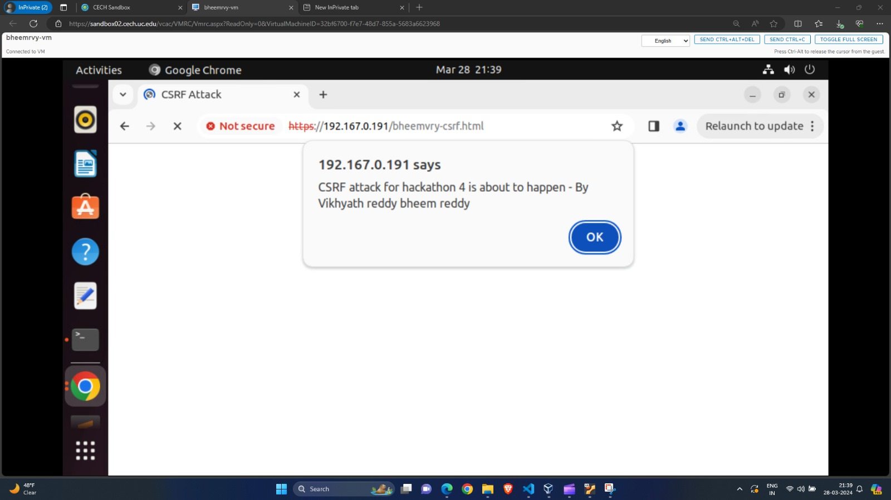

# WAPH-Web Application Programming and Hacking

## Instructor: Dr. Phu Phung

## Student

### Name: Bheemreddy Vikhyath Reddy
### Email: bheemrvy@mail.uc.edu

## Repository Information
### Repository's URL: [https://github.com/Vikhyath-Reddy/waph-bheemrvy](https://github.com/Vikhyath-Reddy/waph-bheemrvy)
### This is a private repository which is used to store all the codes related to course Topics in Computer Systems. The structure of this repository is as mentioned below.

# Hackathon 4 

## Lab's overview

In this hackathon, the primary focus lies on addressing vulnerabilities like cross-site request forgery (CSRF) attacks, as well as implementing safeguards against cross-site scripting (XSS) within a vulnerable blog system application, which is prone to various web-based attacks. We perform both the hacker and the victim role in this to deeply understand the attack. in part 1 we attack both as victim and the hacker and in part 2 we comprehend the CSRF vulnerability and its protective measures.

Link to Hackthon4 code : [https://github.com/Vikhyath-Reddy/waph-bheemrvy/tree/main/Hackthons/Hackthon4](https://github.com/Vikhyath-Reddy/waph-bheemrvy/tree/main/Hackthons/Hackthon4)

## Task 1: Attacks

### Step 1 

1) In any URL/website the CRSF vulnerability is observed could be exploited to provide unauthorized commands which are tricky wants the user to click on it and submit a web request which they don't expect to.
URL: https://waph-hackathon.eastus.cloudapp.azure.com/csrf/changepassword.php

2) HTTP Post request is used.

3) To exploit the vulnerability 'changepassword' filed in the page used in request.

### Step 2

Created a page bheemrvy-csrf.html which directs to the changePassword page. And added a comment in the blog section of the page with phising code. Waits for user(Victim) ti click on the link in the comment section. Once clicked it redirects to change password screen and provide the attacher password mking victim unable to access the application.

Comment: Hi From Vikhyath Reddy <a onclick="windows.location='http://localhost/Myapp.html'">click here for 100$ vocher.</a>

 

 

### Step 3

Once the victim clicked on the comment shows a pop-up warning and then clicked on OK! redirects to change password page. Here whn given option to change password again indicating the successs, password change which is not authorized is triggered.

 

Video Link: [https://youtu.be/Vv7Se631sos](https://youtu.be/Vv7Se631sos)

## Task 2: Understanding the CSRF vulnerability and protection mechanism 

### Exploited Vulnerabilities

With No user authentication verification on the page let the attacker sends state-changing requests which is the primary vulnerability. No checking the request origins before clicking on it and also didn't check the referer headers giving the attacker a free hand to attack.

Without anti-CSRF tokens, attackers could make requests that looked just like real ones. The attack worked also because of the app didn't stick to the Same-Origin Policy, letting external HTTP requests slip through for unauthorized actions.

### Protection Mechanisums

As developers, we can take steps to protect our applications from CSRF attacks. Here's how:

1) Check for the Attacker origins and don't allow to inject code in the comment or any blog page which are clickable. Adding Tockens which keep track of users action weather is genuine or not whoch ats aginst CSRF attck.

2) Following Content Security Policy (CSP) allowing us to dictate where resources are sourced from, providing defense against CSRF attacks and shielding against threats such as Cross-Site Scripting (XSS).

3) We can also use the 'SameSite' attribute in cookies to instruct the browser to send them back only if the request comes from our own domain, which helps stop CSRF attacks originating from other websites.

