 WAPH-Web Application Programming and Hacking

Instructor: Dr. Phu Phung

Student

Name: Bheemreddy Vikhyath Reddy
Email: bheemrvy@mail.uc.edu


Repository Information
Repository's URL: [https://github.com/Vikhyath-Reddy/waph-bheemrvy](https://github.com/Vikhyath-Reddy/waph-bheemrvy)
This is a private repository which is used to store all the codes related to course Topics in Computer Systems. The structure of this repository is as mentioned below.

Hackathon 1 - Cross-site Scripting Attacks and Defences

Lab's overview

This Hackathon focuses on raising awareness about XSS attacks, understanding code vulnerabilities, adhering to OWASP guidelines, and implementing secure coding practices to defend against cross-site scripting attacks. The lab comprises two tasks:

Task 1 involves attacking the URL http://waph-hackathon.eastus.cloudapp.azure.com/xss/, which contains six levels of vulnerabilities.
Task 2 entails mitigating XSS attacks through secure coding practices, emphasizing input validation and output sanitization.

Link to Hackthon1 code : [https://github.com/Vikhyath-Reddy/waph-bheemrvy/tree/main/Hackthons/Hackthons1]([https://github.com/Vikhyath-Reddy/waph-bheemrvy/tree/main/Hackthons/Hackthons1])

Task 1: Attacks

Level 0

URL : [http://waph-hackathon.eastus.cloudapp.azure.com/xss/level0/echo.php](http://waph-hackathon.eastus.cloudapp.azure.com/xss/level0/echo.php)
Script to attack:
```
<script>alert('Level 0 - Hacked by Vikhyath Reddy Bheemreddy')</script>
```

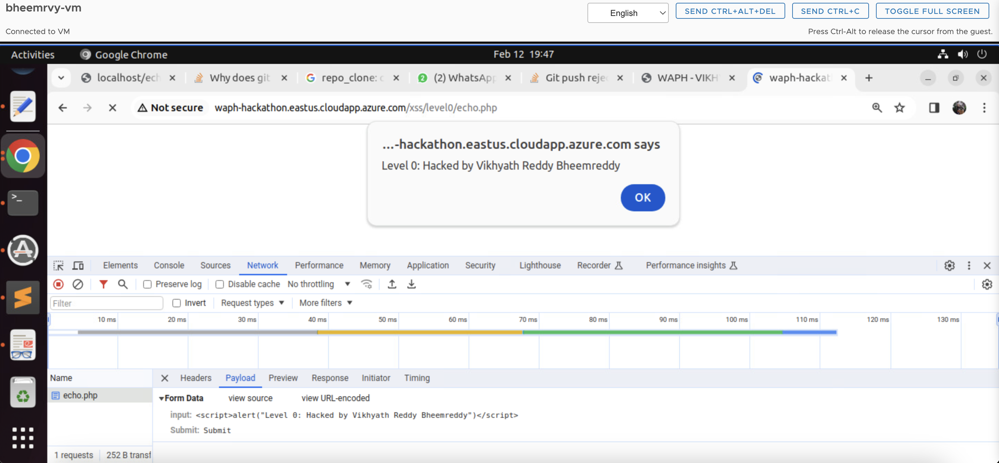

Level 1

URL : [http://waph-hackathon.eastus.cloudapp.azure.com/xss//level1/echo.php](http://waph-hackathon.eastus.cloudapp.azure.com/xss/level1/echo.php)
Leveraging XSS vulnerabilities typically entails appending a malicious script at the end of the URL.

```
input=<script>alert('Level 1 - Hacked by Vikhyath Reddy Bheemreddy')</script>
```

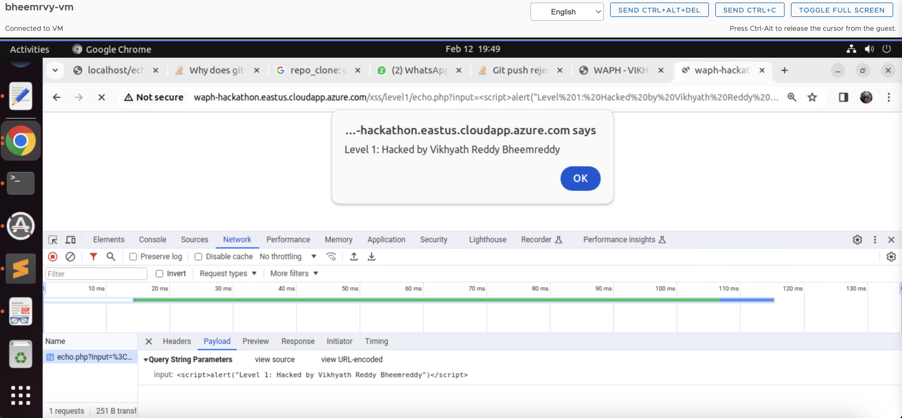

Level 2

URL : [http://waph-hackathon.eastus.cloudapp.azure.com/xss/level2/echo.php](URL : http://waph-hackathon.eastus.cloudapp.azure.com/xss/level2/echo.php)

This URL is associated with an HTML form rather than engaging with user inputs or path variables within the HTTP request. Through this form, it becomes possible to directly insert attacking scripts. This approach facilitates the injection of malicious code into the web application, thereby enabling the examination of XSS vulnerabilities.

```
input=<script>alert('Level 2 - Hacked by Vikhyath Reddy Bheemreddy')</script>
```
Possible Code:
```
	if(!isset($_POST['input']))
	{
		die("{\"error\": \"Please provide 'input' field in an HTTP POST Request\"}");
	}
	echo $_POST['input'];
```

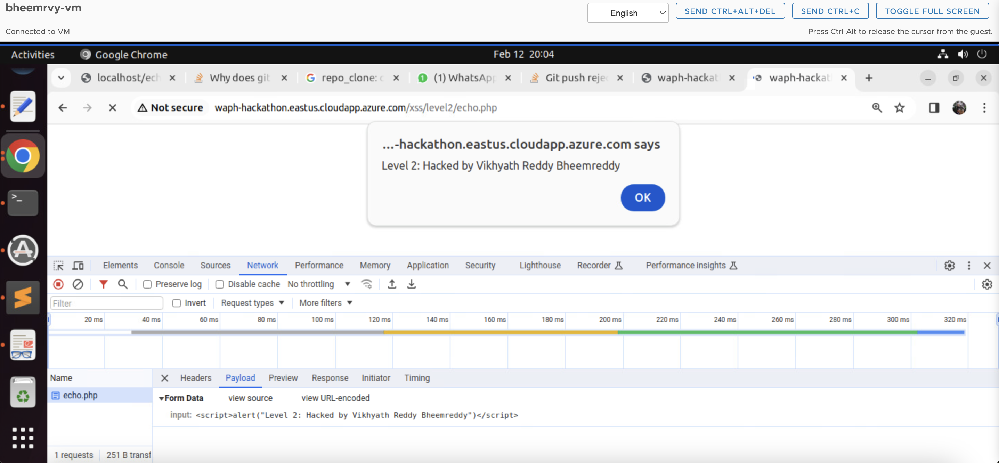

Level 3

URL : [http://waph-hackathon.eastus.cloudapp.azure.com/xss/level3/echo.php](URL : http://waph-hackathon.eastus.cloudapp.azure.com/xss/level3/echo.php)

In order to successfully attack the URL and evade the filtering of `<script>` tags sent through input variables directly, the attacking code needs to be fragmented and then reassembled. This approach showcases the persistence and ingenuity necessary in XSS attacks, as it allows for the injection of malicious code capable of triggering alerts on specific web pages.

```
input=<scr<sc<script>ript>ipt>alert('Level 3 - Hacked by Vikhyath Reddy Bheemreddy')</scr</sc</script>>>
```

Code Possibility:
```
	$input = echo $_POST['input'];
	$input = str_replace(['<script>', '</script>'], '', $input)
```

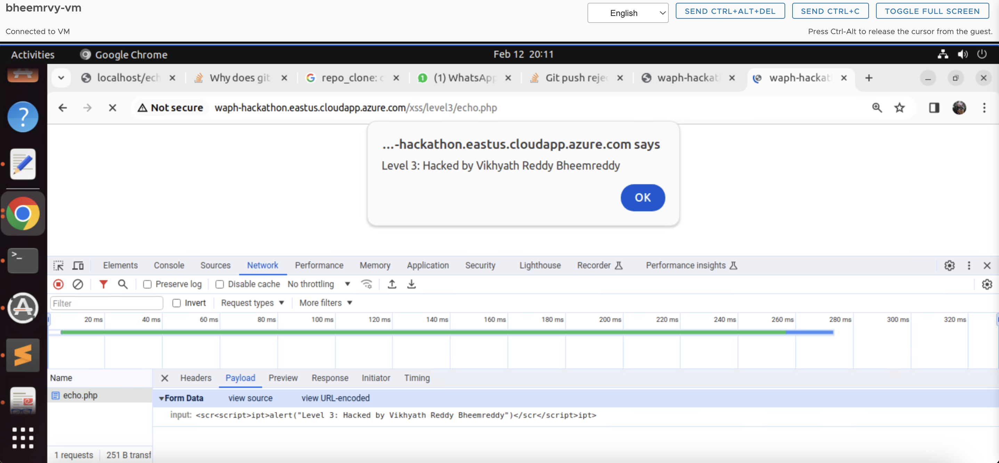

Level 4

URL : [http://waph-hackathon.eastus.cloudapp.azure.com/xss/level4/echo.php](URL : http://waph-hackathon.eastus.cloudapp.azure.com/xss/level4/echo.php)

I tried using the `onload()` event of the `<body>` tag for an XSS script, but even with script manipulation, the `<script>` element remained fully filtered. However, embedding the script within the `onload()` event still triggered an alert on page load, bypassing the filter and enabling the injection of harmful code without relying on the `<script>` tag.

```
input = <body onload="alert('Level 4 - Hacked by Vikhyath Reddy Bheemreddy')">This website is hacked</body>
```

Possible Source code:
```
	$input = $_GET['input']
	if (preg_match('/<script\b[^>]*>(.*?)<\/script>/is', $input)) 
	{
		exit('{"error": "No \'script\' is allowed!"}');
	}
	else 
		echo($input);

```

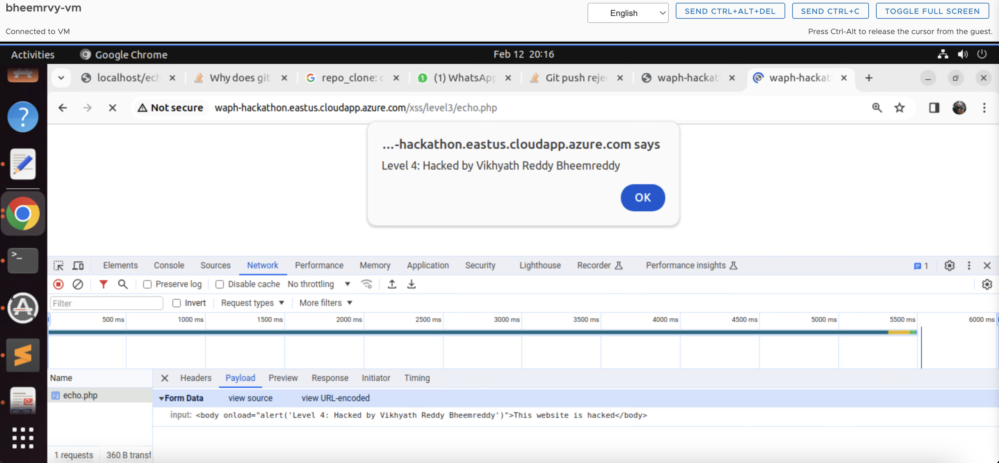

Level 5

URL : [http://waph-hackathon.eastus.cloudapp.azure.com/xss/level5/echo.php](URL : http://waph-hackathon.eastus.cloudapp.azure.com/xss/level5/echo.php)

Enhancing security measures in level 5 involved encoding the `<body>` tag with the `onload()` function. This tactic bypasses direct filters on `<script>` and `alert()` functions, allowing for the indirect execution of JavaScript code. Utilizing Unicode encoding ensures proper interpretation of characters as JavaScript code by the browser, enabling the desired functionality of triggering a popup alert.

```
input=<body onload="\u0061alert('Level 5 - Hacked by Vikhyath Reddy Bheemreddy')">This website is hacked</body>
```

Possible Source Code:
```
	$input = $_GET['input']
	if (preg_match('/<script\b[^>]*>(.*?)<\/script>/is', $data) || stripos($data, 'alert') !== false) 
	{ 
		exit('{"error": "No \'script\' is allowed!"}');
	}
	else 
		echo($input);
```

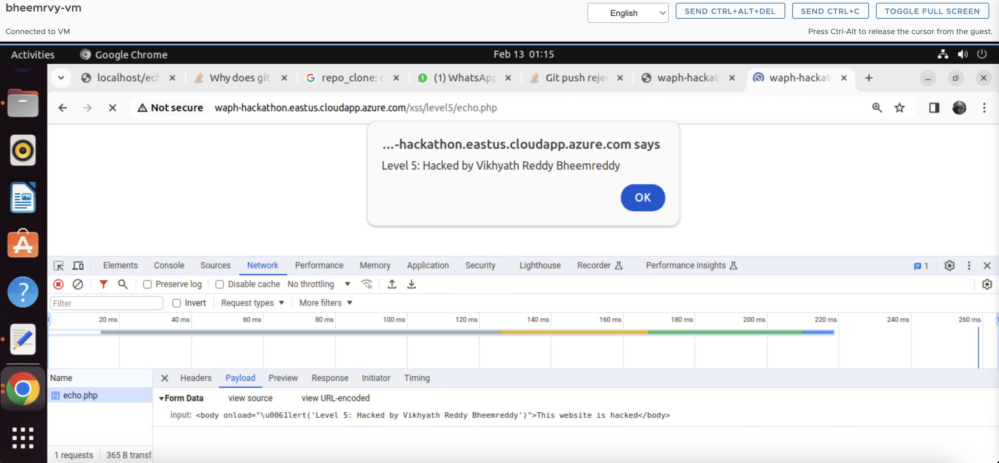

Level 6

URL : [http://waph-hackathon.eastus.cloudapp.azure.com/xss/level6/echo.php](URL : http://waph-hackathon.eastus.cloudapp.azure.com/xss/level6/echo.php)

Using the htmlentities() method, user input is converted into HTML entities, displaying it solely as text on the webpage. JavaScript event listeners, such as onclick(), are then employed to initiate an alert whenever a key is entered in the user input, enabling the execution of JavaScript code while maintaining the security precaution of displaying user input as plain text.

```

```

Possible Source code:
```
echo htmlentities($_REQUEST('input'));
```

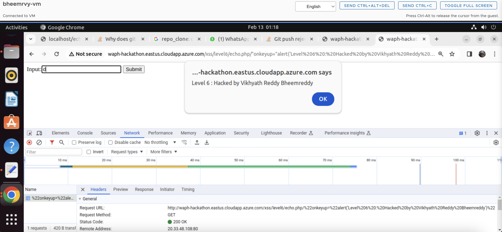 


Task 2 : DEFENCE

a. echo.php

Security against XSS attacks has been significantly improved in the updated echo.php file for Labs 1 and 2. Initially, the script verifies if the input is empty; if it is, PHP execution is stopped to stop additional processing. The input is cleaned using the htmlentities() function after it has been validated. By transforming potentially dangerous characters into their appropriate HTML entities, this function ensures that they are safe to see on the webpage. This reduces the possibility of XSS vulnerabilities and guarantees that the input is handled just as text.


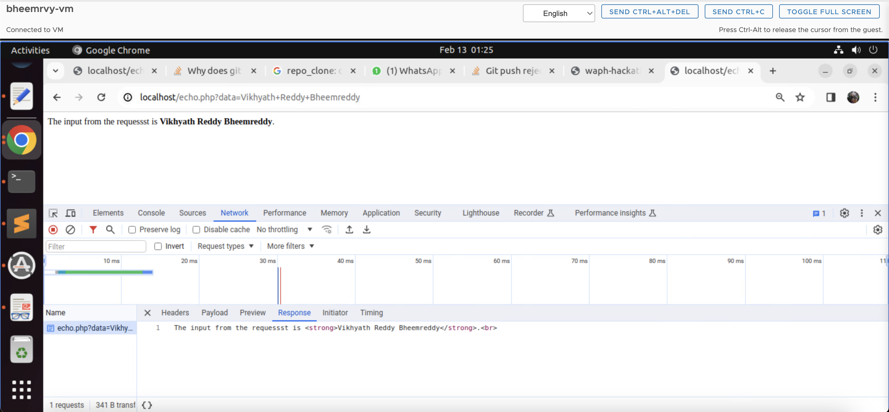

b. Front-end prototype

1. To enhance the security of both POST and GET requests, a validation function called validateInput() has been introduced. This function mandates user input text to ensure the data's validity before executing the request. Additionally, instances where plain text is displayed instead of HTML rendering have been identified to mitigate the risk of XSS attacks. To mitigate the possibility of executing any attacking scripts, the innerHTML property has been substituted with innerText for checking plain text. These measures collectively fortify the web application's security protocols concerning input validation and output rendering.

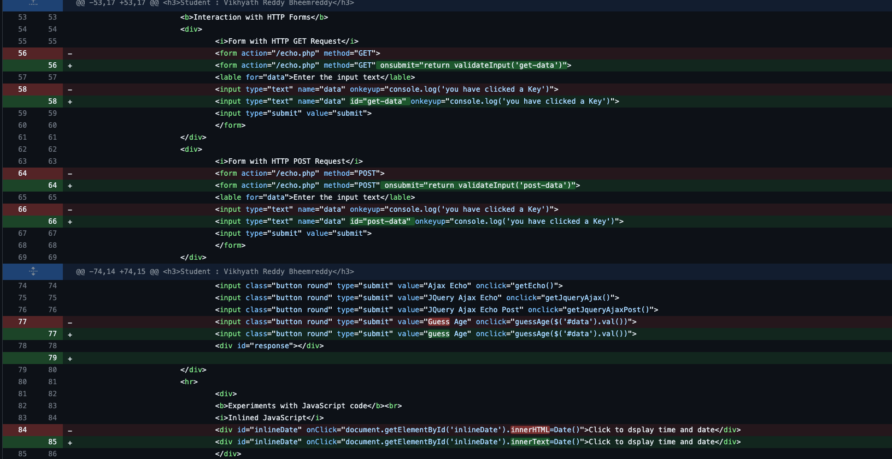

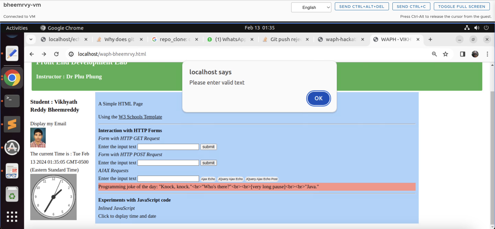

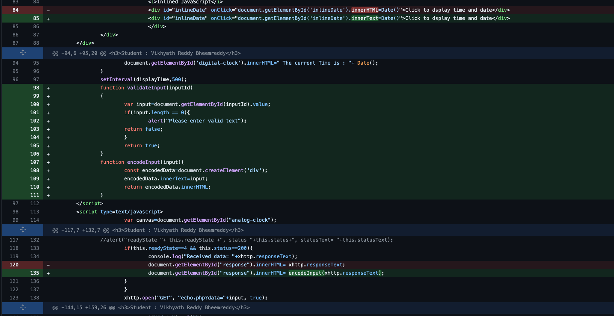

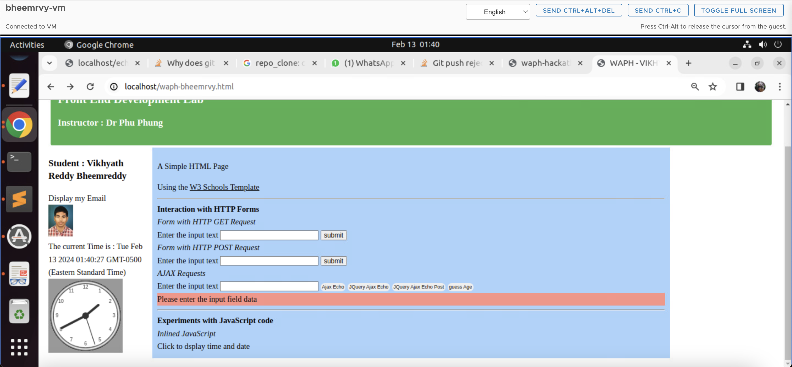

2. EncodeInput() function, introduced recently, aims to prevent XSS attacks by transforming special characters into HTML entities, rendering HTML content as plain text, thus immune to malicious scripts. It generates a new `<div>` element, appends the sanitized content (innerText), and returns the HTML content within this div, ensuring enhanced security against XSS vulnerabilities.

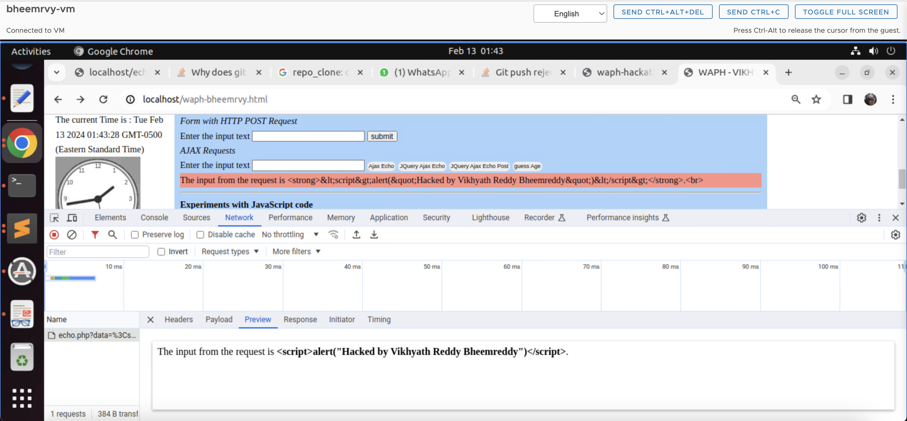

3. To enhance security and reliability, additional validation checks have been implemented in API calls. Specifically, when fetching jokes from the [JokeAPI](https://v2.jokeapi.dev/joke/Programming?type=single), checks are now in place to ensure that both the JSON response and the result.joke property are not empty. If either of these variables is found to be null, an error message is promptly displayed to alert the user. These measures aim to bolster the dependability of the application by ensuring that valid data is retrieved from the API.

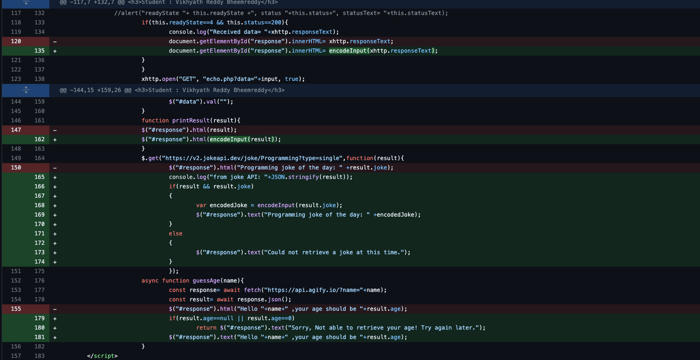

4. To enhance the reliability and security of the application, further validation steps have been integrated into the guessAge() function. These steps include verifying that the user's input is not null or empty and confirming that the obtained output is neither empty nor zero. If any of these criteria are not met, a relevant error message notifies the user. These enhancements aim to minimize errors, ensure data accuracy, and bolster the application's dependability and security.

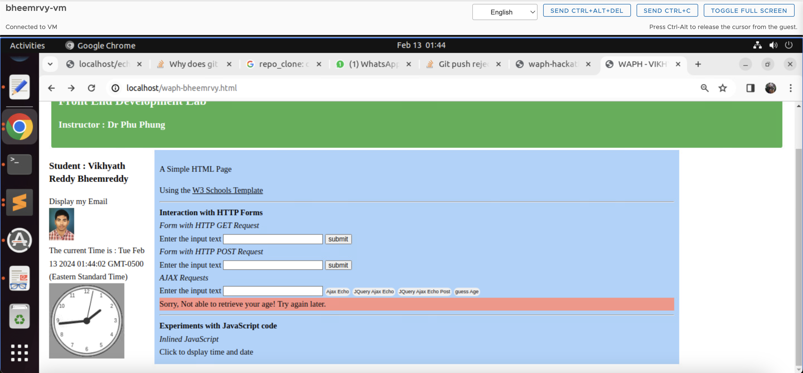
