WAPH-Web Application Programming and Hack-ing

Instructor: Dr. Phu Phung Student

Name: Bheemreddy Vikhyath Reddy

Email: bheemrvy@mail.uc.edu

Fig 1: Vikhyath’s photo

Respository’s URL: https://github.com/Vikhyath-Reddy/waph-bheemrvy

The lab’s overview

The HTTP protocol and web application programming will be covered in Lab 1. Using Wireshark to analyze HTTP traffic and Telnet to establish direct communication with HTTP servers, the first segment, Part I, takes us through the intricacies of these tasks. Comprehending the fundamental elements, techniques, and responses of the HTTP protocol is the main aim.We'll examine web application programming using the Common Gateway Interface in Part II. Here, we build a basic C web application that accepts user input. The lab also covers PHP web application programming, shedding light on the security concerns and the distinctions between HTTP GET and POST requests. The goal of this extensive lab experience is to teach you a realistic understanding of web application development concepts, CGI, and HTTP.

Github repository: https://github.com/Vikhyath-Reddy/waph-bheemrvy/tree/main/labs/Lab1.

Part I

Task 1

A robust tool for comprehensive HTTP protocol analysis that gives you a deep understanding of client-server interactions is Wireshark. To get the most of Wireshark, start by choosing the network interface that is going to handle the expected amount of HTTP traffic. Capture has start, select the displayed filter and enter "http" to focus only on packets pertaining to HTTP.Take a detailed look at the headers, methods, and content of the gathered packets in order to fully comprehend the communication dynamics and unravel the intricacies of the request-response cycle.

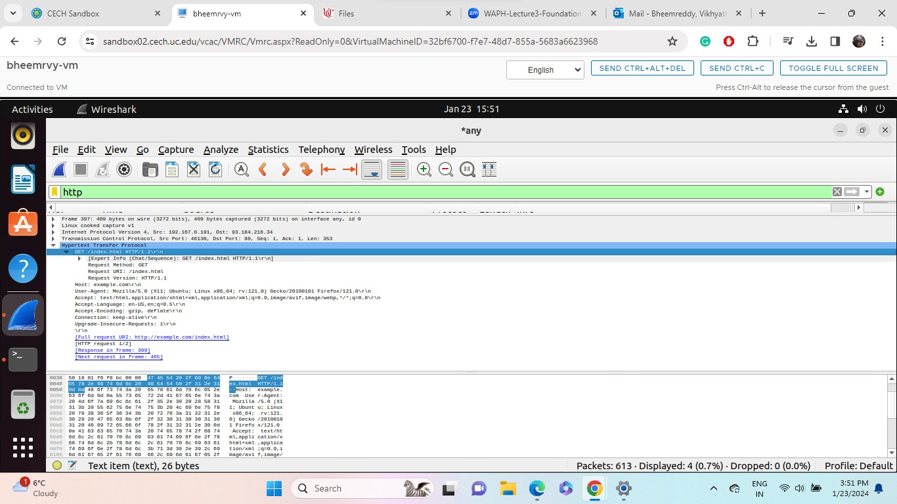

Fig 2

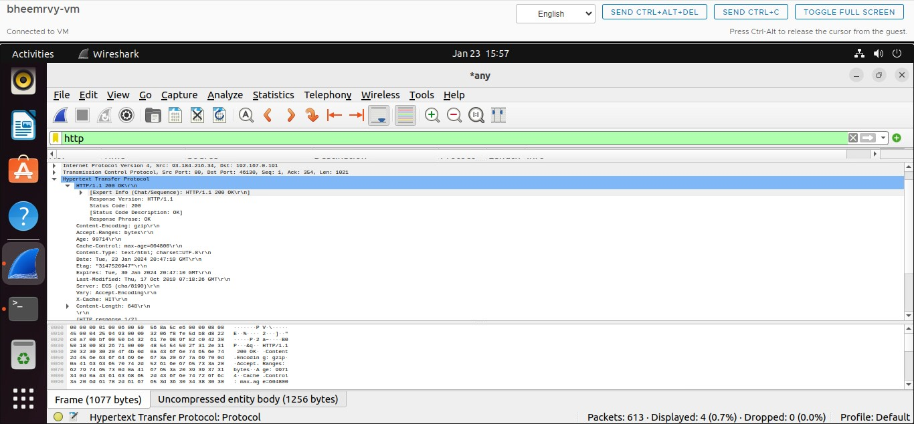

Fig 3

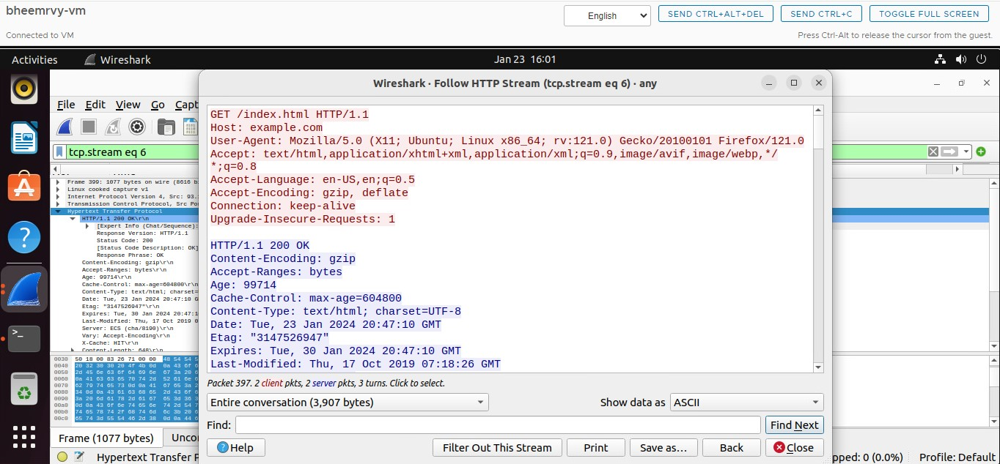

Fig 4

Task 2 

After the connection has been made, manually construct a simple HTTP request by providing the required information, such as the resource path, HTTP version, and HTTP method (such as GET). 

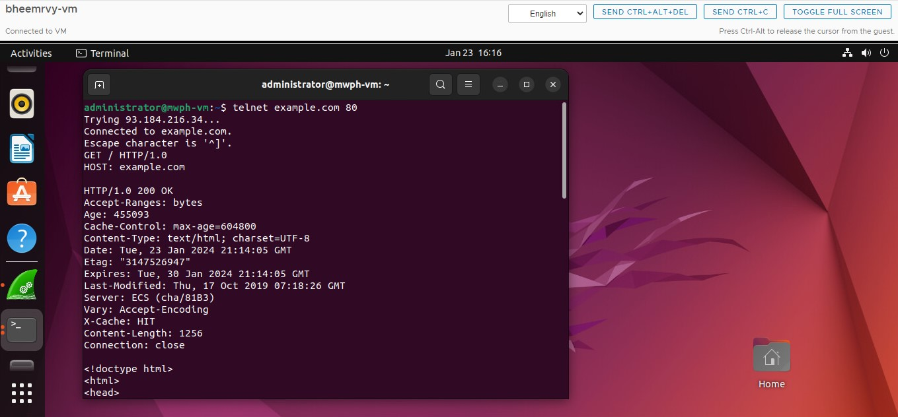

Fig 5

Part II 

Task 1 

The first step in writing a Hello World CGI application in C is to create a file called "helloworld.c" that contains the required CGI headers. Prior to including the HTML text, include the HTTP text-Type header in this file. The CGI application will be run by the web server, and the generated output will be shown in the browser. This streamlined method shows you how to install and compile a fundamental CGI program in

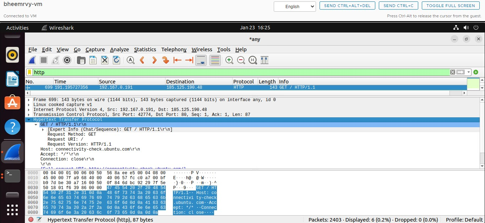

Fig 6: Telnet_Request_in_Wireshark

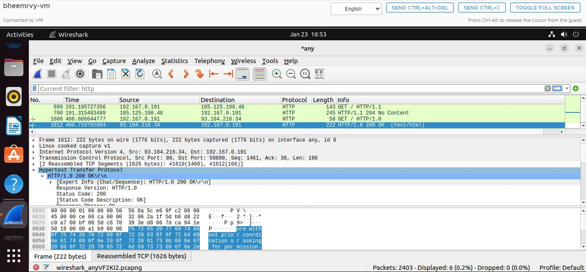

Fig 7: Telnet_Response_in_Wireshark

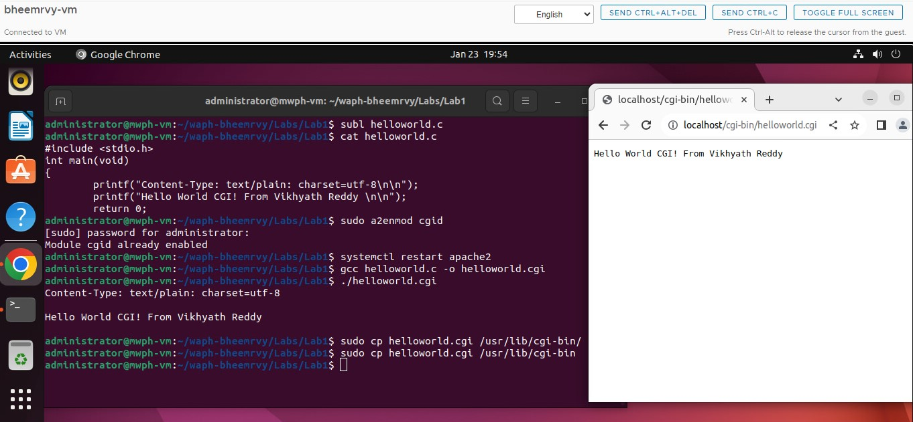

Fig 8: Helloworld.c_CGI_Program

1. To show that they were proficient in creating CGI applications, they created a "index.c" file by a basic HTML design that had the appropriate header, title, and paragraph elements.

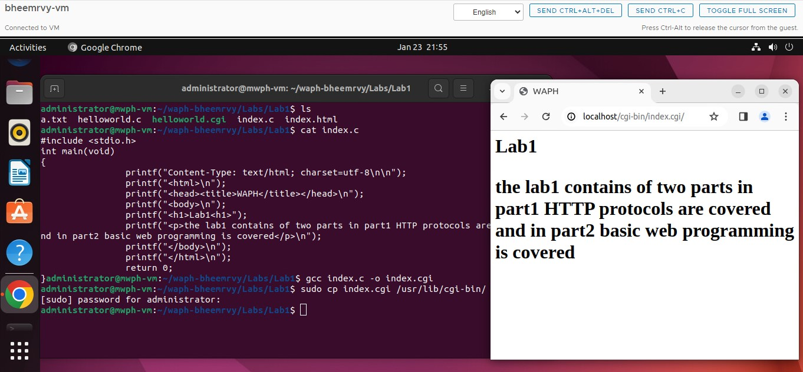

Fig 9: Index.c_CGI_Program

Task 2 
1. Make a "helloworld" PHP script and save with ".php" suffix. Move the PHP script to the page root of the web server, typically found at /var/www/html.Open a web browser and use the server's URL, such as http://localhost/helloworld.php, to access the PHP script. The PHP script will be run by the server when you access this URL, and the results will be rendered and shown by the browser.

2) For the "echo.php" application:

Make an application by creating a "echo.php" script. To run the PHP script, navigate to the appropriate URL on the web server. The browser will show the output from the "echo.php" application after the script processes the request.

File echo.php is included: PHP $_REQUEST["data"]; <?php echo?>
Risks to Security:
• Data can originate from a number of sources when $_REQUEST is used, including user input through URL parameters. However, this approach leaves room for data tampering if the input lacks sufficient validation or sanitization procedures. This highlights how important it is to have robust security measures in place to lessen the possibility of unauthorized data alteration.
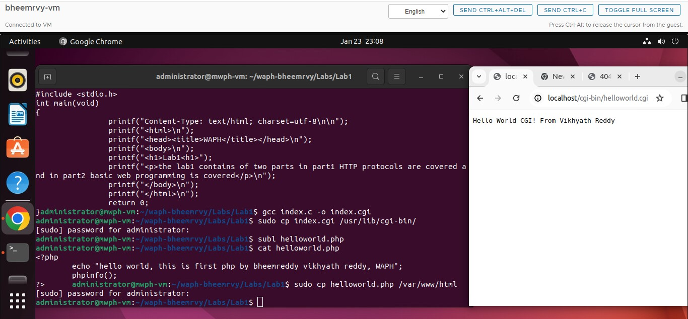
Figure 10: Hello_world_PHP_program

Figure 11: Echo_PHP_Program
Task 3 
1. First, choose the network interface that is anticipated to carry HTTP traffic. Then record HTTP traffic with the url and start capturing,select the display filterand type http .

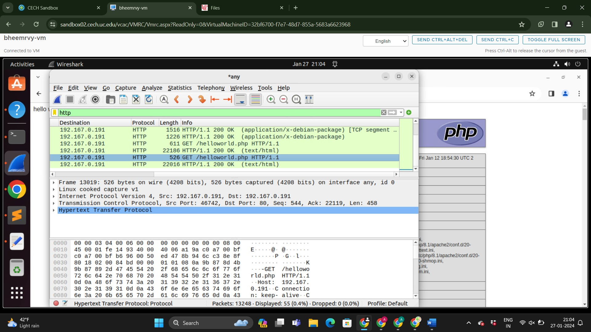
Fig 12: Echo_PHP_Wireshark_Request

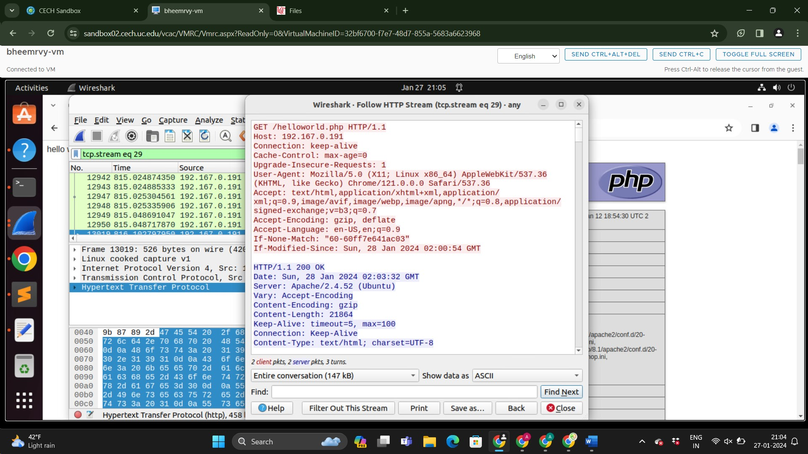

Fig 13: Echo_PHP_Wireshark_Response

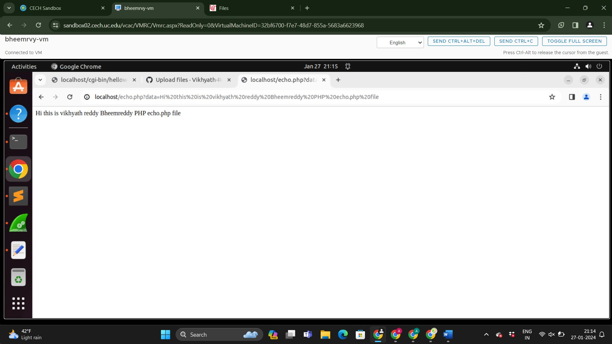

2. curl
create an HTTP Post Request

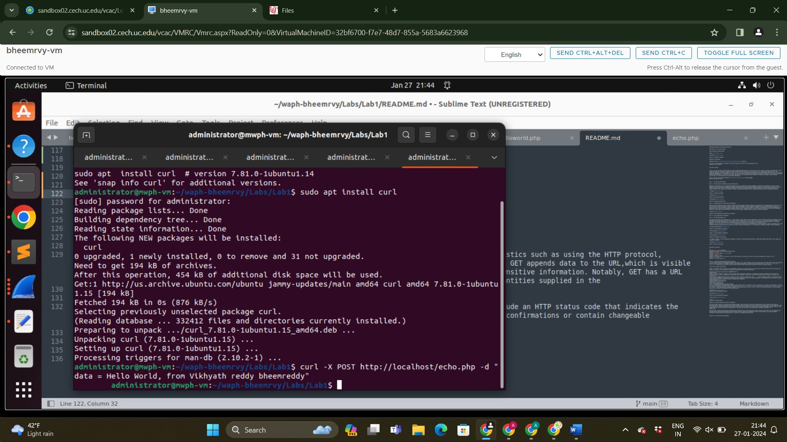

Fig 15: curl

Within the HTTP protocol, GET and POST requests are used as a means of communication between clients and servers. Both include a Request URI and need headers. POST transfers data within the request body, providing greater security for sensitive information, whereas GET adds info to URL, which is displayed in address bar. Because of limitations on URL length, GET is best suited for smaller amounts of data, while POST performs better when the request body is longer.

Caching of URLs is possible for GET queries, however POST answers are not frequently cached. Each answer has an HTTP status code, and while POST responses can provide varying information or act as confirmations, GET responses frequently contain the requested content. It is essential to comprehend these differences in order to design web applications effectively.

s

Fig 16: curl_HTTP_stream_in_Wireshark
