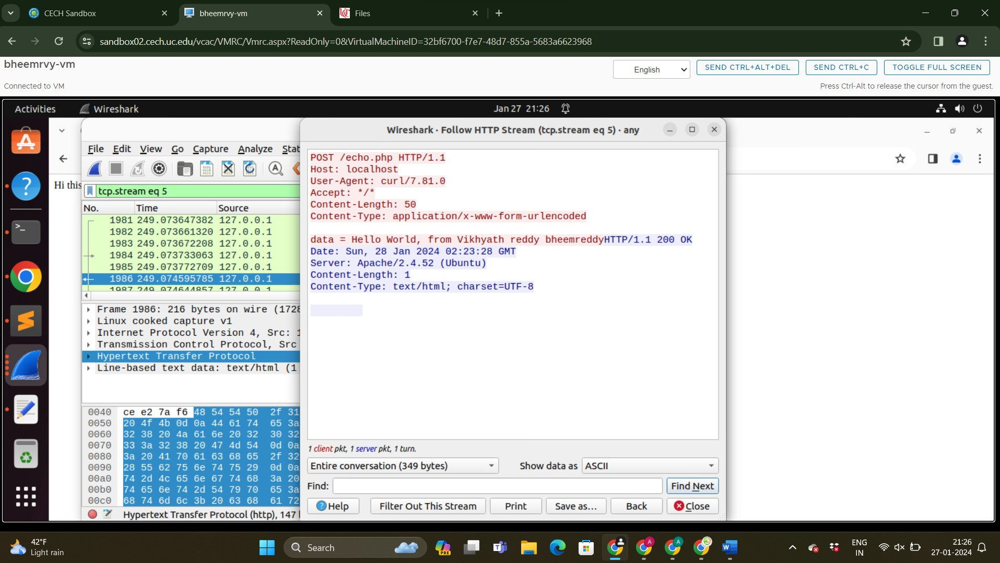

WAPH-Web Application Programming and Hack-ing

Instructor: Dr. Phu Phung Student

Name: Bheemreddy Vikhyath Reddy

Email: bheemrvy@mail.uc.edu


Figure 1: Vikhyath’s headshot

Repository Information

Respository’s URL: https://github.com/Vikhyath-Reddy/waph-bheemrvy

This is a private repository for Divakar to store all code from the course. The organization of this
repository is as follows.s


The lab’s overview


In Lab 1, we will go over the HTTP protocol and how to program web applications. The first section, Part I, walks us through the complexities of HTTP traffic analysis with Wireshark and hands-on contact with HTTP servers via Telnet. The primary goal is to understand the HTTP protocol's core components, methods, and replies. Moving on to Part II, we'll look at web application programming and the Common Gateway Interface. Here, we construct a simple web application in C that handles user input. The lab also covers web application programming using PHP, giving light on the differences between HTTP GET and POST requests, as well as the security implications. This comprehensive lab experience is intended to provide a practical grasp
of HTTP, CGI, and the principles of web application development.

Here is the link to the Github repository https://github.com/Vikhyath-Reddy/waph-bheemrvy/tree/main/labs/Lab1.


Part I - The WEB and HTTP Protocol

Task 1 - Familiar with the Wireshark tool and HTTP protocol

Wireshark is a powerful tool for in-depth HTTP protocol analysis, providing a thorough knowledge of client-server interactions. To fully utilize Wireshark, begin by selecting the appropriate network interface that will handle the anticipated HTTP traffic. After starting the capture, go to the display filter and type "http" to narrow the emphasis to HTTP-related packets.Examine the collected packets to untangle the complexities of the request-response cycle, paying close attention to headers, methods, and content to gain a complete understanding of the communication dynamics.


Figure 2: example.com_Request


Figure 3: example.com_Response


Figure 4: example.com_HTTP_Stream

Task 2 - Understanding HTTP using telnet and Wireshark

Using the telnet software to send a simple HTTP request entails starting a terminal connection and connecting to the specified server on port 80. Once the connection has been established, manually create a basic HTTP request by giving necessary components such as the HTTP method (e.g.,GET), the resource path, and the HTTP version. Finally, hit the "Enter" key twice to send the request. To examine the complexities of HTTP communications using Wireshark, start a capture on the appropriate network interface. Use a display filter for "http" to narrow the focus on HTTP traffic. The Wireshark output will then clearly display the details of the sent HTTP request, including headers and data for further inspection.


Figure 5: Sending_Request_by_using_Telnet_in_terminal

Part II - Basic Application Programming

Task 1 - CGI Web applications in C

To develop a Hello World CGI application in C, first create a C source code file named "helloworld.c" that includes the necessary CGI headers. Include the HTTP Content-Type header in this file first, then the HTML content. Next, use a C compiler, such as GCC, to build the C program and create an executable file called "helloworld.cgi." Once compiled, move the executable to the web server's CGI directory ("/usr/lib/cgi-bin/"). To allow CGI execution, set the CGI directory in the web server's settings. Use a web browser to navigate to the relevant URL (for
example, http://localhost/cgi-bin/helloworld.cgi). The web server will execute the CGI application, and the browser will show the produced output. This simplified approach demonstrates how to compile and install a basic CGI application in C on a web server, allowing for dynamic content production.


Figure 6: Telnet_Request_in_Wireshark


Figure 7: Telnet_Response_in_Wireshark


Figure 8: Helloworld.c_CGI_Program

1. Created a "index.c" file to demonstrate competency in building C CGI applications,following a simple HTML template with proper title, header, and paragraph components.


Figure 9: Index.c_CGI_Program


Included file index.c: 
c 
```
#include <stdio.h> int main(void){
printf("Content-Type: text/html; charset=utf-8\n\n"); 
printf("<html>\n");
printf("<head><title>WAPH</title></head>\n"); 
printf("<body>\n");
printf("<h1>Lab1</h1>\n"); 
printf("<p>The lab1 consists of two parts in part 1 HTTP protocols are covered and in part 2 basic web programming is covered</p>\n"); 
printf("</body>\n");
printf("</html>\n"); return 0; }
```

Task 2 - A simple PHP Web Application with user input.
1. Create a PHP script with the content "helloworld" and save it as a ".php" extension. Transfer the PHP script to the web server's page root directory, which is normally located at /var/www/html.Launch a web browser and navigate to the PHP script using the server's URL, such as http://localhost/helloworld.php. When you visit this URL, the server will execute the PHP script,and the browser will render and show the results.

2) For the "echo.php" application:

Create a "echo.php" script to function as an application. Navigate to the relevant URL on the web server to execute the PHP script. The script will process the request, and the browser will display the output from the "echo.php" application.

Included file echo.php: php <?php echo $_REQUEST["data"]; ?>
Security Risks:
• When the "data" argument is filled in with user input without sufficient validation or sanitization,it becomes vulnerable to XSS (Cross-Site Scripting) attacks. In such circumstances, attackers may insert malicious scripts that run when other people access the website, providing a huge security risk.
• The usage of $_REQUEST enables data to come from a variety of sources, including user input       via URL parameters. However, if the input does not include adequate validation or sanitization mechanisms, this strategy opens the door to data manipulation. This emphasizes the significance of having strong security measures to reduce the danger of unwanted data tampering.

Figure 10: Hello_world_PHP_program

Figure 11: Echo_PHP_Program
Task 3 - Understanding HTTP GET and POST requests.
1. Start by selecting the network interface through which the HTTP traffic is expected in my case I selected any to capture the HTTP traffic. Open the web browser and navigate to the PHP script using the server’s URL http://localhost/echo.php?data=Hi%20this%20is%20vikhyath%20reddy%20Bheemreddy%20PHP%20echo.php%20file Once the capture is initiated, navigate to the display filter and enter “http” to filter out HTTP-related packets. The below images demonstrates the Request and Response of the echo.php script


Figure 12: Echo_PHP_Wireshark_Request


Figure 13: Echo_PHP_Wireshark_Response


2. curl
create an HTTP Post Request


Figure 15: curl_POST_request HTTP stream in Wireshark

HTTP GET and POST requests are communication techniques between clients and servers that share characteristics such as using the HTTP protocol, including headers, including specifying a Request URI. However, their differences lay in data submission: GET appends data to the URL,which is visible in the address bar, whereas POST transmits data within the request body, providing more protection for sensitive information. Notably, GET has a URL length-based size restriction,making it appropriate for less data, but POST excels at handling bigger quantities supplied in the
request body.

GET queries are cacheable, enabling URL bookmarking, but POST answers are rarely cached.Both answers include an HTTP status code that indicates the outcome; however, GET responses frequently offer requested material, whereas POST responses may serve as confirmations or contain changeable information. Understanding these characteristics is critical for creating good online apps.

s

Figure 16: curl_HTTP_stream_in_Wireshark
