# WAPH-Web Application Programming and Hacking

## Instructor: Dr. Phu Phung

## Student

### Name: Bheemreddy Vikhyath Reddy
### Email: bheemrvy@mail.uc.edu

## Repository Information
### Repository's URL: [https://github.com/Vikhyath-Reddy/waph-bheemrvy](https://github.com/Vikhyath-Reddy/waph-bheemrvy)
### This is a private repository which is used to store all the codes related to course Topics in Computer Systems. The structure of this repository is as mentioned below.

# Lab's overview

This laboratory exercise provides an instructional outline for developing a secure web application using PHP/MySQL. Initially, the database setup is performed in the terminal window, granting access to the database and establishing a connection with the root user. A new database is then created using the account setup command, aimed at facilitating user learning and permission management. Subsequently, a table is configured to enhance the functionality of the login page. The implementation of a login system utilizing PHP and MySQL is detailed, showcasing the deployment of the login page. To assess vulnerabilities, XSS and SQL Injection Attacks are simulated. Finally, measures to safeguard the login page are explored, including the utilization of SMTP requests to bolster security.

### Link to Lab3 code : [https://github.com/Vikhyath-Reddy/waph-bheemrvy/tree/main/Labs/Lab3](https://github.com/Vikhyath-Reddy/waph-bheemrvy/tree/main/Labs/Lab3)

## Database Setup and Management:

### Installation of MySQL

The process begins with the installation of MySQL using the command `sudo apt-get install mysql-server -y`, followed by accessing MySQL with `sudo mysql -u root -p`. Subsequently, a new database is created and permissions are initiated through the `database.account.sql` command. Login credentials are then entered into a database table using MySQL, facilitating the setup of a new database account. The creation of a new table named Users is executed, with data insertion including hashed passwords. Verification of the table creation and data insertion is done with `show databases` and `SELECT * FROM users;` commands respectively. Throughout, SQL commands are utilized to define the structure of the Users table, specifying column data types and constraints. This step ensures the proper organization and security of the database, enhancing the functionality of the web application.

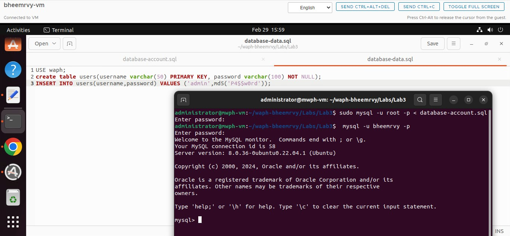

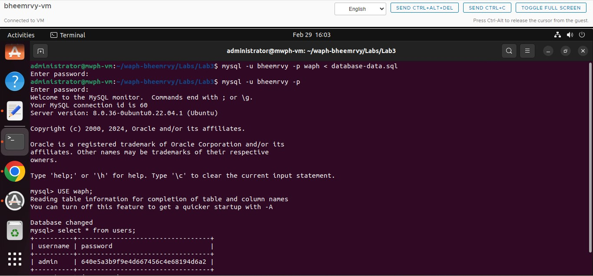

### A Simple Login System with PHP/MySQL

To set up the necessary PHP and MySQL drivers, begin by running `sudo apt-get install php-mysqli` and restart Apache using `sudo service apache2 restart`. Next, modify the `index.php` file as instructed by adding a `checklogin_mysql` function for database authentication, which verifies user credentials against the MySQL database. After making these changes, test and deploy the updated files (`index.php` and `form.php`) in the web server directory, ensuring accessibility by the web server. Finally, conduct login tests with both valid and invalid username/password combinations to confirm the functionality of the login system. This process ensures the proper installation of PHP and MySQL drivers and validates the effectiveness of the login functionality within the web application.

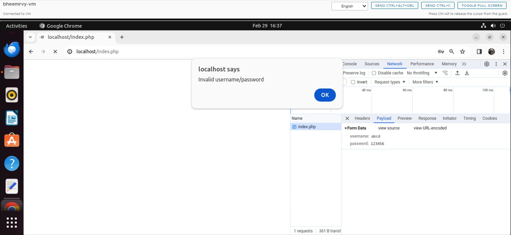

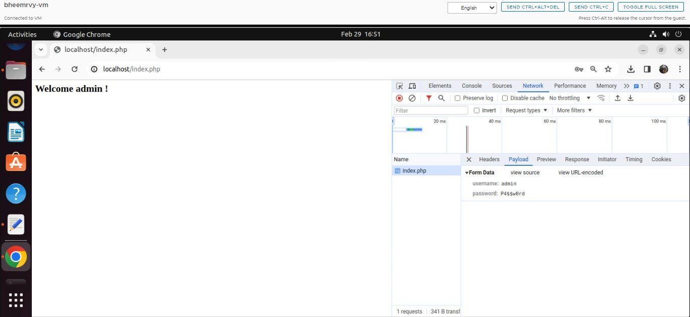

### XSS and SQL Injection Attacks

During the SQL Injection Attack phase, we initiate the test attack by injecting basic malicious SQL code. This attack involves entering harmful SQL code into the username field of a login form, aiming to surpass authentication. By manipulating the query, the injected SQL code can lead to unexpected outcomes, such as gaining unauthorized access without a valid login and password. The login form showcases the username field containing the SQL injection payload, demonstrating its successful bypass of authentication and unauthorized access to the network. The vulnerability to SQL injection attacks arises from inadequate input validation and the absence of valid queries within the application code. When user input isn't thoroughly checked, input fields become susceptible to malicious SQL code insertion by attackers.

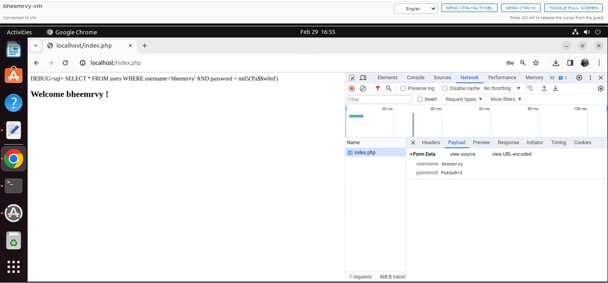

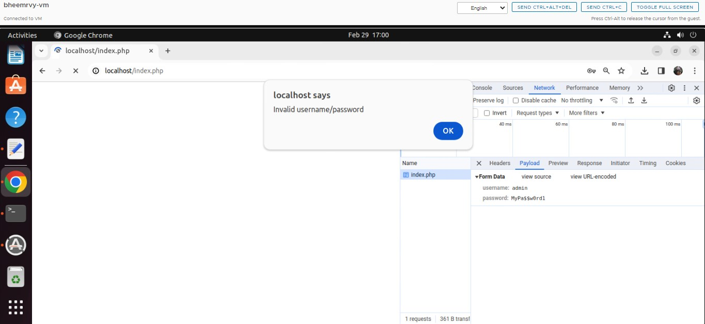

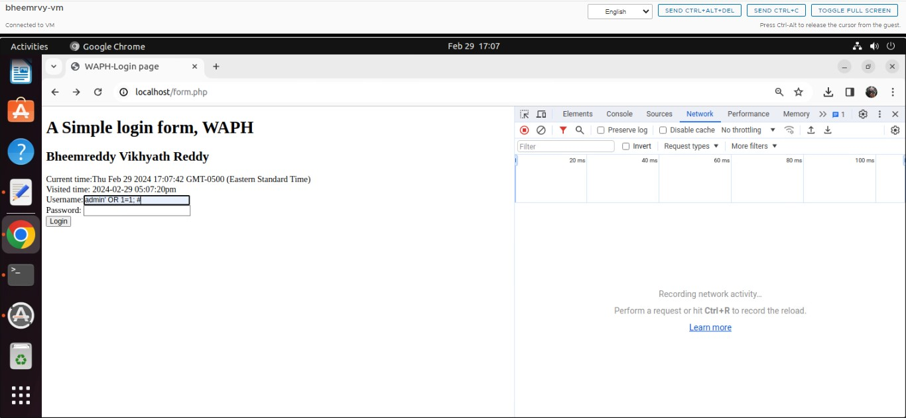

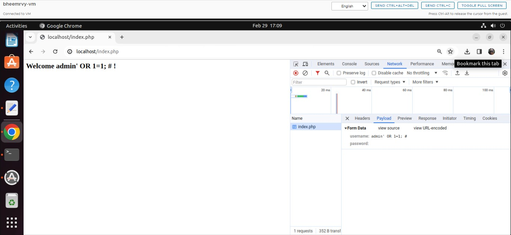

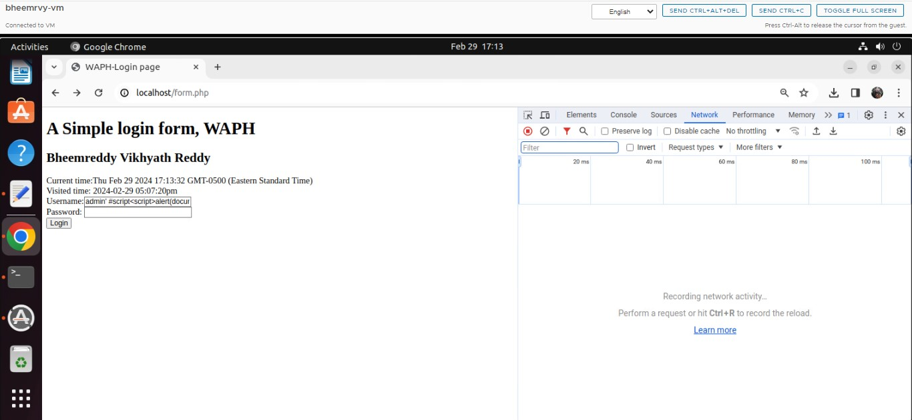

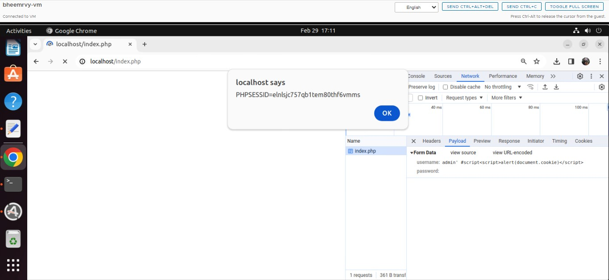

### Prepared Statement Implementation

The PHP program undergoes several security enhancements, such as the implementation of prepared statements and password hashing to prevent SQL injection attacks. Prepared statements isolate SQL code from data, making it difficult for attackers to insert malicious code. Parameterized queries further secure the system by treating input data as information rather than executable SQL code, thus preventing SQL injection. Additionally, password hashing with the md5() function adds an extra layer of security by encrypting passwords stored in the database. The program also utilizes the mysqli extension for secure database connections and incorporates error handling to ensure continuous operation and minimize vulnerabilities. However, there are still some areas of concern, such as concatenating input values directly into the query string, which could lead to confusion and potential vulnerabilities. The program also lacks proper handling of empty username/password fields, potentially allowing unauthorized access. Continuous updates and vigilance regarding database errors are crucial for maintaining system security. Moreover, input validation and normalization techniques are essential for preventing flaws and ensuring data accuracy and integrity.

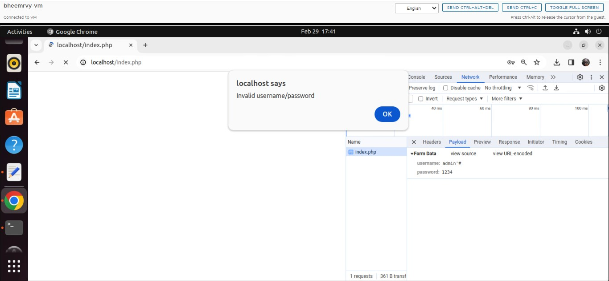

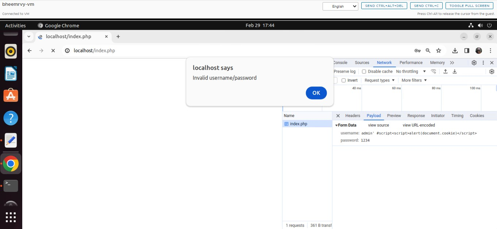
