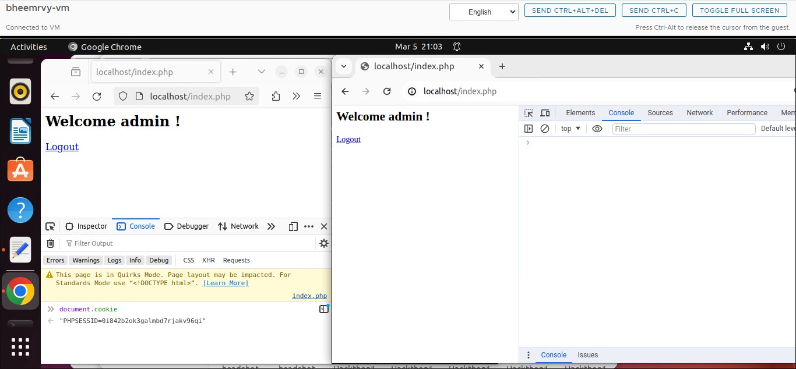
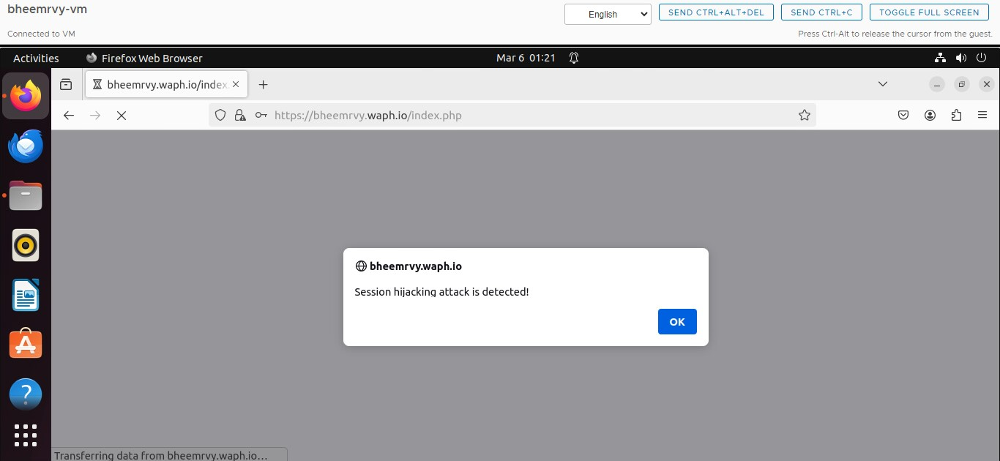

# WAPH-Web Application Programming and Hacking

## Instructor: Dr. Phu Phung

## Student

**Name**: Bheemreddy Vikhyath Reddy

**Email**: bheemrvy@mail.uc.edu

## Repository Information

Respository's URL: [https://github.com/Vikhyath-Reddy/waph-bheemrvy](https://github.com/Vikhyath-Reddy/waph-bheemrvy)

# Lab4

## overview

From the Lab4 I gained understandig of PHP Web Application Session managment. From the creation of the session and analyzing it by wireshark and hijacking it between the web browsers. Knowm about session cookies further more and their vernalabilities and how to avoid and handle by HTTPPonly Stream.

Here is the link to the Github repository

[https://github.com/Vikhyath-Reddy/waph-bheemrvy/tree/main/Labs/Lab4](https://github.com/Vikhyath-Reddy/waph-bheemrvy/tree/main/Labs/Lab4).

## Task 1 

### 1a: Deploy and test

Opened the sessiontest.php in both the browsers where the each browser keep track of the individual session count respectively.

### 1b: Observe the Session-Handshaking using Wireshark

While running the sessiontest.php accessing it by the help of the wireshark. The session handshaking process is captured and can find a link between the users's session and its session cookies.

### 1c: Understanding Session Hijacking

I have loaded the sessiontest.php in the firefox for 14 times them copied the cookied ID into the chrome and loaded and the chrome web browser has been loaded for 15 times continuing from the sessiontest.php loaded in the firefox.

## Task 2

### 2a: Revised Login System with Session Management

Created a logout.php file and adding logout feature. And added changes to the index.php where auorized login can be done and unauthorized logins are alerted.

### 2b: Session Hijacking Attacks

Session hijacked using two web browsers by mean of the cookies from one web browser to another which made login successful in the browser with not authorized credentials.

## Task 3

### 3a: Data Protection and HTTPS Setup

The https was setup on my browser. SSL certficate is displayed below which provides secured connectionbetween the server and the client. And viewed form.php below using https.

### 3b: Securing Session Against Session Hijacking Attacks - setting HttpOnly and Secure flags for cookies

Inserted the sessions security settings for session cookies. Confirming through the browser's developer tools that the HttpOnly and Secure flags are correctly set enhances web application security by reducing the risk of session hijacking. The HttpOnly flag prevents access to cookies via client-side scripts, while the Secure flag ensures cookies are only sent over HTTPS connections. This verification indicates that the application is taking necessary measures to protect user sessions, making it harder for attackers to gain unauthorized access.

### 3c: Securing Session Against Session Hijacking Attacks - Defense In-Depth

Following the authentication process, browser information was stored in a session variable within the index.php file. The screenshot depicts the defense mechanism, illustrating how to detect and address session hijacking attempts.

