# WAPH-Web Application Programming and Hacking

## Instructor: Dr. Phu Phung

## Student

### Name: Bheemreddy Vikhyath Reddy
### Email: bheemrvy@mail.uc.edu

## Repository Information
### Repository's URL: [https://github.com/Vikhyath-Reddy/waph-bheemrvy/tree/main/individual-project2](https://github.com/Vikhyath-Reddy/waph-bheemrvy/tree/main/individual-project2)
### This is a private repository which is used to store all the codes related to course Topics in Computer Systems. The structure of this repository is as mentioned below.

# Project 2

## Project overview

I am building a safe and user-friendly web platform using PHP and MySQL in this project. It will manage user accounts, allowing people to sign up, log in, and manage their profiles securely. My focus is on keeping their information safe by using techniques like password hashing and secure session management. This project is a great opportunity to strengthen my skills in web development and security.

 Link to Project code : [https://github.com/Vikhyath-Reddy/waph-bheemrvy/tree/main/individual-project2](https://github.com/Vikhyath-Reddy/waph-bheemrvy/tree/main/individual-project2)

 Demonstration Link: [Video Link](https://youtu.be/C9tQCdHWXM0)

## Functional Requirements

### 1) User Registration

I've developed a user registration page that collects user information such as name, email, username, and password through input fields. To ensure data accuracy, I've utilized regular expressions on the client side to validate user input against predefined criteria. Furthermore, I've integrated password matching functionality to double-check the accuracy of entered passwords.

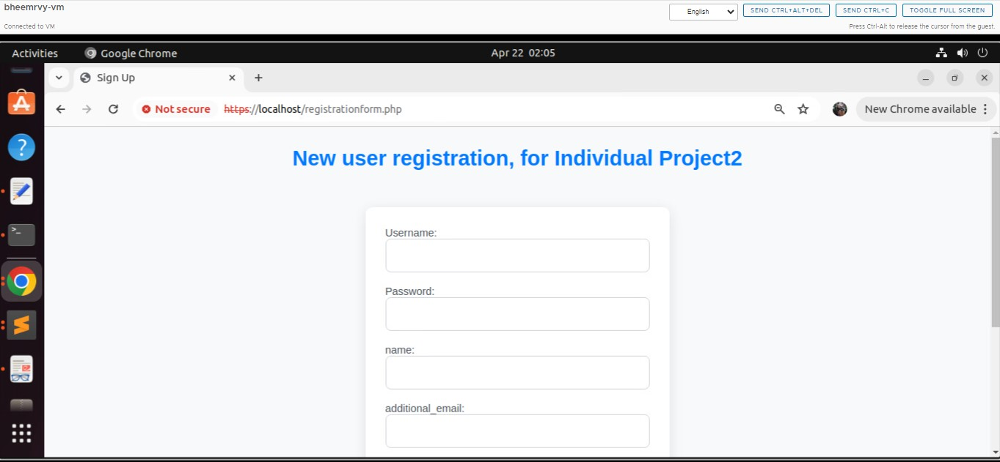

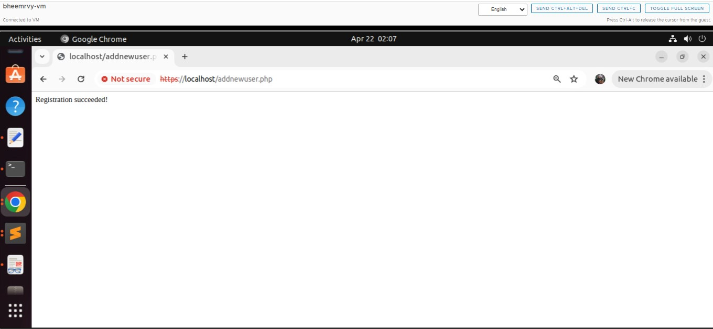

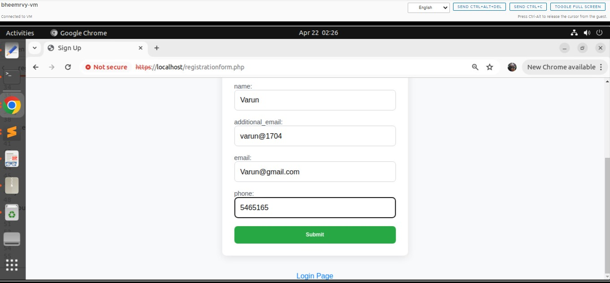

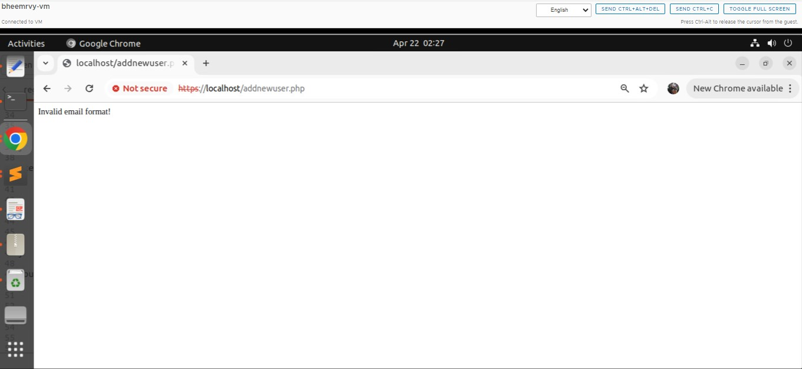

### 2) Login Form

I've set up a straightforward login form where users can enter their username and password. Once they hit submit, the system checks these details against our database to confirm they're accurate. This step ensures that only authorized users can access the protected sections of my application, making it more secure and user-friendly.

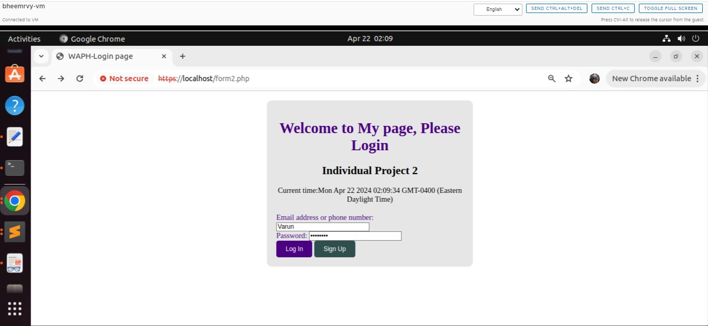

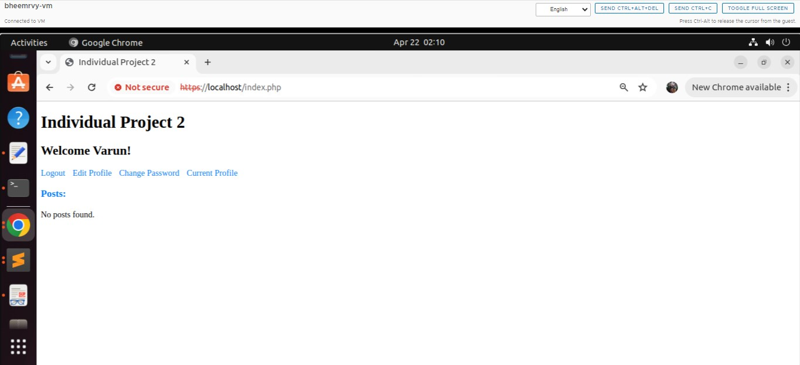

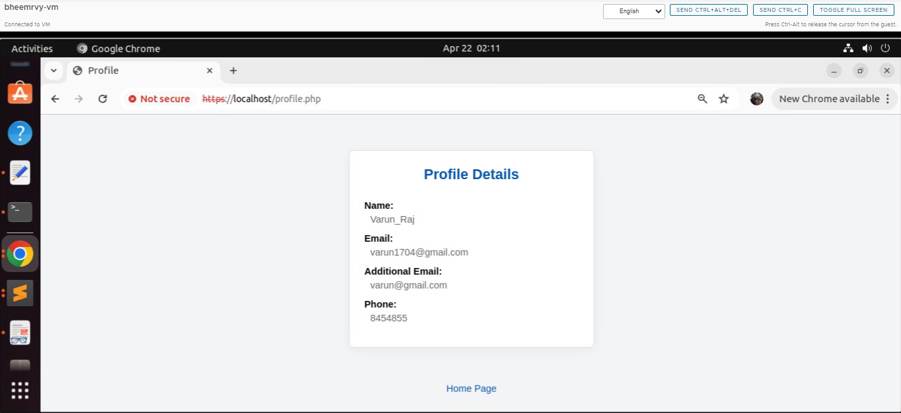

### 3) Profile Management

The "Edit Profile" form is a crucial part of my website, letting users easily tweak their details. It's designed to be user-friendly, with clear headings and input fields for name and email. To keep things safe, a PHP script called session_auth.php makes sure only logged-in users can access it. Once info is submitted, the PHP script handles it securely, even checking for any sneaky attempts to mess with it. After everything's confirmed, it updates the user's data in the database. Users get a quick heads-up on whether the changes went through, along with a secure logout option. This setup keeps things smooth for users while making sure everything stays safe and sound.

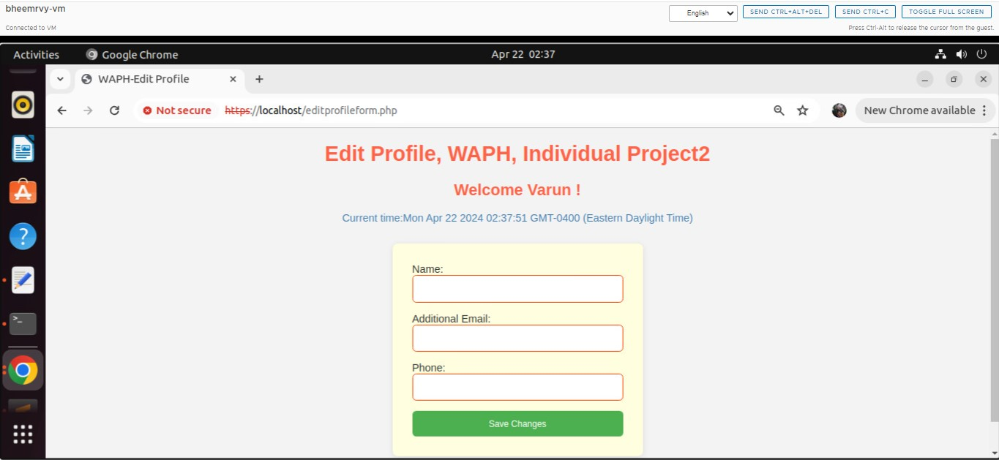

### 4) Password Update

There's a special spot for changing passwords. It's a form in HTML, all styled up to look good with CSS. But before folks can use it, they've gotta pass through a guard called session_auth.php. It checks if they're logged in and keeps everything safe from sneaky tricks with a CSRF token. Once they're in, users can enter their username and new password. Then, a PHP script talks to the database using MySQLi to securely update the password. After that, users get a message saying if it worked or not, along with a safe logout link. This setup makes it easy for users to stay secure while managing their accounts.

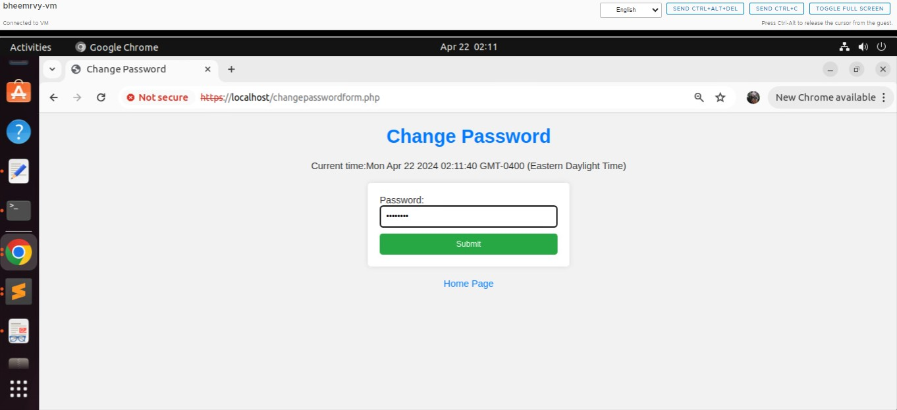

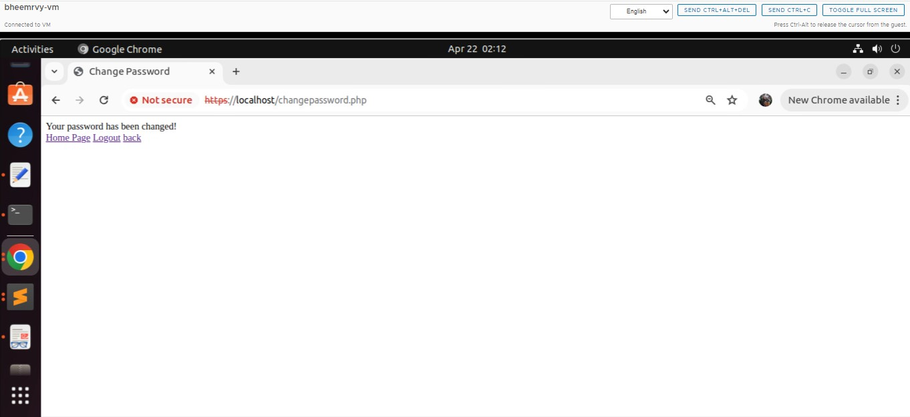

## Security and non-technical Requirements
 
### 1) Security

In my web app, I've implemented crucial security measures to protect user data and ensure system security. Firstly, HTTPS encryption is used to encrypt all information transmitted between users and the server, preventing unauthorized access. Passwords are hashed before storage in the database, making them unreadable even if the database is compromised. Additionally, database access is restricted by using a separate account with limited permissions instead of the MySQL root account. Finally, all database operations employ prepared statements to prevent SQL injection attacks by treating user input as data rather than commands. These measures collectively prioritize user security, providing peace of mind for users while using the app.

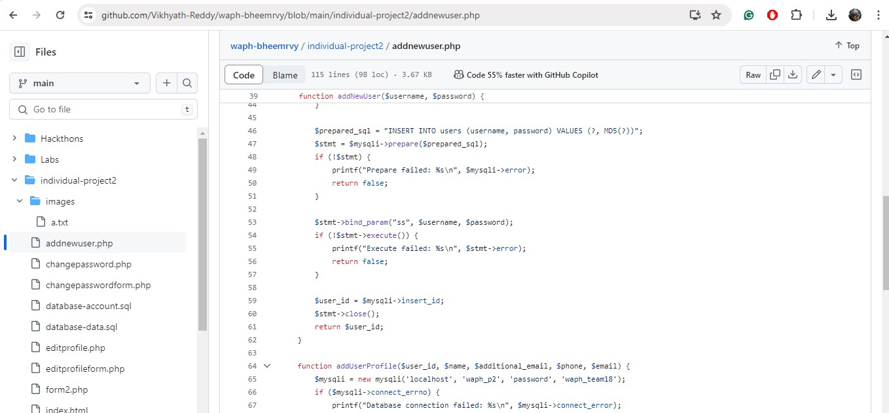

### 2) Input Validation

To ensure robust protection against common web vulnerabilities like XSS (Cross-Site Scripting) attacks, I've implemented comprehensive input validation measures on both the client and server sides. On the client side, I utilize HTML input attributes such as required, pattern, and maxlength to enforce basic validation rules directly within the browser. Additionally, I've integrated custom JavaScript validation to ensure that input fields meet specific criteria, including minimum length, format, and character restrictions. Furthermore, I prioritize sanitizing user input before rendering it on the client side to mitigate XSS risks.

On the server side, I conduct thorough validation of all user input to uphold data integrity and security. Employing techniques such as regular expressions and built-in validation functions, I verify input against expected formats and lengths. Moreover, I enforce the use of parameterized queries or prepared statements for database interactions, effectively thwarting SQL injection attacks. Output encoding is also employed to sanitize user-generated content before rendering, thereby mitigating XSS vulnerabilities.

### 2) Input Validation

When setting up a MySQL database to store user data securely, it's crucial to plan things out carefully. Think of it like organizing a filing cabinet – you want each drawer (or table) to hold specific types of information neatly. So, you'll create tables for user details and anything else you need, making sure each one has clear labels and rules to keep everything tidy and accurate. And when you're working with the database, always double-check your actions to make sure you're keeping everything safe and sound. It's like handling important documents – you want to make sure they're in the right place and handled with care. 

### 3) Front-end development

To make my website easy to use, I organize the pages with clear titles and navigation bars. Then, I make everything look good with different fonts, colors, and layouts that work on any device. I also add a bit of JavaScript to help users fill out forms correctly and get instant feedback. This makes the whole experience smooth and enjoyable for visitors, while also following all the latest web rules.

### 4) Session Management

I've implemented measures to prevent session attacks by verifying user authentication for each request, monitoring session duration, securing session parameters, and validating web browsers. This ensures only authenticated users with valid sessions can access protected resources, while also detecting and responding swiftly to any suspicious activity.

### 5) CSRF Protection

To keep the bad guys out, I've added anti-CSRF tokens, especially when users tinker with the database. These tokens are like secret codes, hidden within forms or requests. When someone sends a form, the server checks these codes to make sure it's not a sneaky trick from outside. Whether it's updating user details or making transactions, these tokens add an extra lock, ensuring only legit users can make changes. This beefs up the app's security and puts a stop to any shady business, keeping our database safe from harm.

